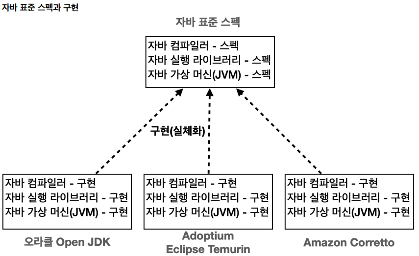

[김영한의 자바 입문 - 코드로 시작하는 자바 첫걸음](https://www.inflearn.com/course/%EA%B9%80%EC%98%81%ED%95%9C%EC%9D%98-%EC%9E%90%EB%B0%94-%EC%9E%85%EB%AC%B8/dashboard)
을 보고 정리한 자료입니다.
스프링 부트, JPA 등의 프레임워크 및 웹 개발을 공부하는 것과 동시에
자바에 대해 기초부터 중급까지 차근차근 공부해 보고 싶어져서 공부를 시작하게 되었습니다.  
하지만 자바에 대해 이미 기본적인 것은 숙지하고 있기 때문에 모르거나 중요한 부분, 또는 헷갈리는 부분만
정리하겠습니다.

## 자바 표준 스펙

- 자바는 표준 스펙과 구현으로 나누어져 있다.
- 여러 회사에서 자바 표준 스펙에 맞추어 실제 작동하는 자바 프로그램을 개발한다.

