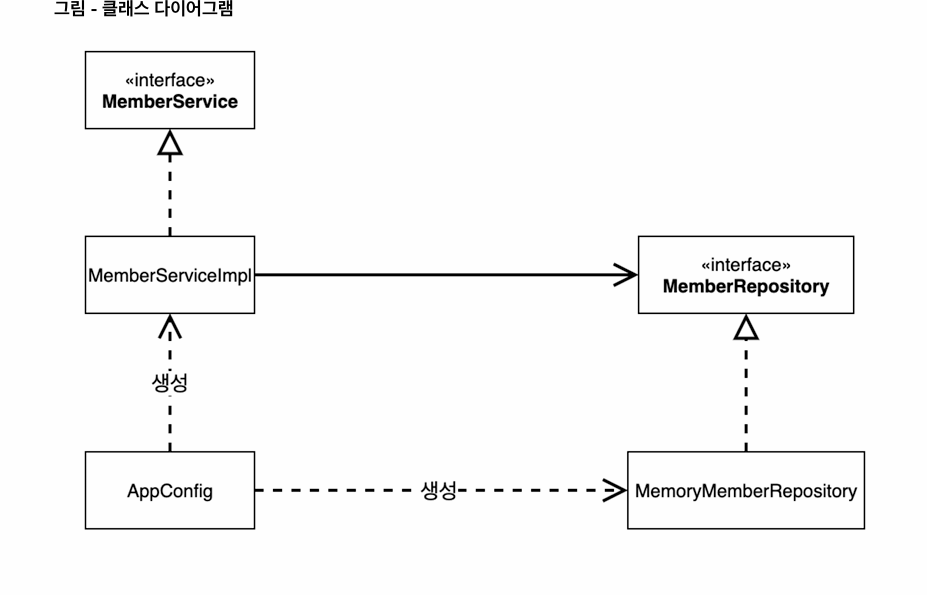
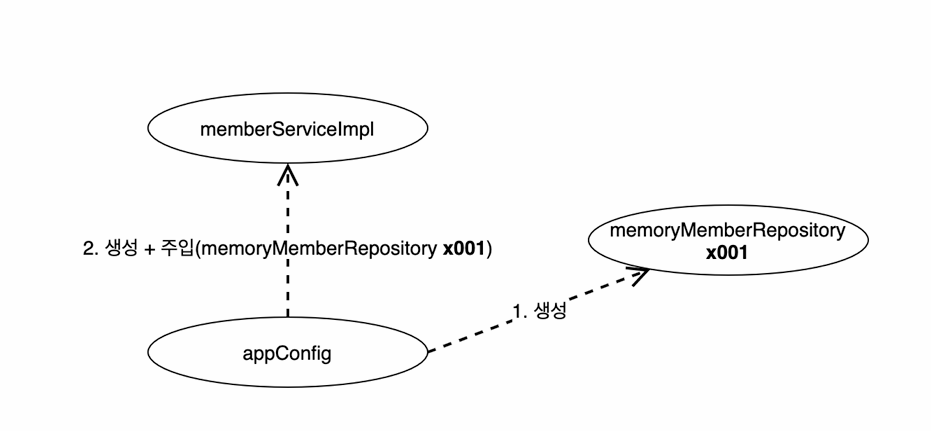

## 관심사의 분리
- Appconfig는 애플리케이션의 실제 동작에 필요한 구현 객체를 생성한다.
- MemberServiceImpl, MemoryMemberRepository, OrderServiceImpl, FixDiscountPolicy

- Appconfig는 생성한 객체 인스턴스의 참조(레퍼런스)를 생성자를 통해서 주입해준다.
- MemberServiceImpl -> MemoryMemberRepository
- OrderServiceImpl -> MemoryMemberRepository, FixDiscountPolicy

- 자세한 코드는 spring 리포지토리를 참고.
- 객체의 생성과 연결은 Appconfig가 담당한다.
- DIP 완성: MemberServiceImpl은 MemberRepository인 추상에만 의존하면 된다. 구체 클래스를 몰라도됨
- 관심사의 분리: 객체를 생성하고 연결하는 역할과 실행하는 역할이 명확히 분리되었다.

객체 인스턴스 다이어그램

- appConfig 객체는 memoryMemberRepository 객체를 생성하고 그 참조값을 memberServiceImpl을
생성하면서 생성자로 전달한다.
- 클라이언트인 memberServiceImpl 입장에서 보면, 의존관계를 마치 외부에서 주입해주는 것 같다고
해서 DI, 의존성 주입이라 한다.
- appConfig를 보면 애플리케이션 전체 구성(역할, 구현 클래스)이 한번에 들어온다.

## 테스트 코드 변경
- 테스트 코드에서 @BeforeEach는 각 테스트를 실행하기 전에 호출된다.

## 전체 흐름 정리
1. 새로운 할인 정책 개발
2. 새로운 할인 정책 적용과 문제점 
- 적용할 때 클라이언트 코드인 주문 서비스 구현체도 함께 변경해야 함.
- DIP 위반 : 클라이언트가 인터페이스, 구체 클래스 모두 의존
3. 해결책: 관심사의 분리
- AppConfig(공연 기획자) 등장 : 구현 객체를 생성하고, 연결하는 책임
- 클라이언트 객체는 자신의 역할을 실행하는 것만 집중, 권한이 줄어듬
4. 새로운 구조와 할인 정책 적용
- Appconfig의 등장으로 애플리케이션이 사용영역과, 객체를 생성하고 구성하는 영역으로 분리
- 할인 정책을 변경해도 Appconfig가 있는 구성 영역만 변경하면 되고, 사용 영역 및 클라이언트 코드 변경할
필요가 없다.

## 제어의 역전, IOC
- 기존 프로그램은 클라이언트 구현 객체가 스스로 필요한 서버 구현 객체를 생성, 연결, 실행하였다.
- Appconfig가 등장한 이후에 구현 객체는 자신의 로직을 실행만 하고, 프로그램의 제어 흐름은 Appconfig가 담당한다.
- 이렇게 프로그램의 제어 흐름을 직접 제어하는 것이 아니라 외부에서 관리하는 것을 IOC라 한다.

## 프레임워크 VS 라이브러리
- 프레임워크가 내가 작성한 코드를 제어하고, 대신 실행하면 프레임워크이다.(JUnit)
- 내가 작성한 코드가 직접 제어의 흐름을 담당한다면 그건 프레임워크가 아니라 라이브러리이다.

## 의존관계 주입, DI
- 의존관계는 정적인 클래스 의존 관계와, 실행 시점에 결정되는 동적인 객체 의존 관계 둘을 분리해서 생각해야 한다.
- 애플리케이션 실행 시점(런타임)에 외부에서 실제 구현 객체를 생성하고, 클라이언트에 전달해서
클라이언트와 서버의 실제 의존관계가 연결되는 것을 의존관계 주입이라 한다.
- 의존관계 주입을 사용하면 클라이언트 코드를 변경하지 않고, 클라이언트가 호출하는 대상의 타입 인스턴스를
변경할 수 있다.
- 의존관계 주입을 사용하면 정적인 클래스 의존관계를 변경하지 않고, 동적인 객체 인스턴스 의존관계를 쉽게
변경할 수 있다.

## IOC 컨테이너, DI 컨테이너
- AppConfig처럼 객체를 생성하고 관리하면서 의존관계를 연결해 주는 것을 뜻한다.
- DI 컨테이너, 어셈블러, 오브젝트 팩토리 등으로도 불린다.

## 스프링 컨테이너
- ApplicationContext를 스프링 컨테이너라 한다.
- 스프링 컨테이너는 @Configuration이 붙은 Appconfig를 설정 정보로 사용한다. 여기서 @Bean이라 적힌 메소드
를 모두 호출해서 반환된 객체를 스프링 컨테이너에 등록한다.
- 스프링 컨테이너에 등록된 객체를 스프링 빈이라 하고, @Bean이 붙은 메소드명을 스프링 빈의 이름으로 사용한다.
- 스프링 빈은 applicationContext.getBean() 메소드를 사용해서 찾을 수 있다.

## 스프링 컨테이너 생성
`ApplicationContext applicationContext = new AnnotationConfigApplicationContext(AppConfig.class);`
- ApplicationContext는 스프링 컨테이너이자, 인터페이스이다.
- 스프링 컨테이너는 파라미터로 넘어온 설정 클래스 정보를 사용해서 스프링 빈을 등록한다.
- 빈 이름은 메서드 이름을 사용하고, 직접 부여할 수도 있다.
- 스프링 컨테이너는 설정 정보를 참고해서 의존관계를 주입한다. 즉, 빈을 생성하고 의존관계를 주입하는 단계가 나누어져 있다.

## 스프링 컨테이너에 등록된 모든 빈 조회
1. 모든 빈 출력하기
- 실행하면 스프링에 등록된 모든 빈 정보를 출력할 수 있다.
- ac.getBeanDefinitionNames() : 스프링에 등록된 모든 빈 이름을 조회한다.
- ac.getBean() : 빈 이름으로 빈 객체(인스턴스)를 조회한다.

2. 애플리케이션 빈 출력하기
- 스프링이 내부에서 사용하는 빈은 getRole() 로 구분할 수 있다.
- Role_Application : 일반적으로 사용자가 정의한 빈
- Role_Infrastructure : 스프링이 내부에서 사용하는 빈

## 스프링 빈 조회 - 기본
- ac.getBean(빈이름, 타입) 또는 ac.getBean(타입) 으로 스프링 빈을 찾는다.
- 조회 대상 스프링 빈이 없으면 예외가 발생한다.
- 타입으로 조회 시 같은 타입의 스프링 빈이 둘 이상이면 오류가 발생하므로, 이때는 빈 이름을 지정해야 한다.
- ac.getBeansOfType()을 사용하면 해당 타입의 모든 빈을 조회할 수 있다.

## 스프링 빈 조회 - 상속 관계
- 부모 타입으로 조회하면, 자식 타입도 함께 조회한다.
- 모든 자바 객체의 최고 부모인 object 타입으로 조회하면, 모든 스프링 빈을 조회한다.

