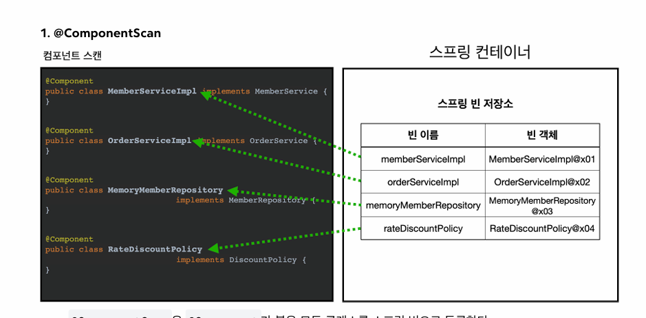
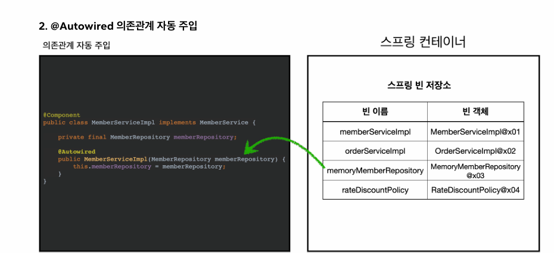
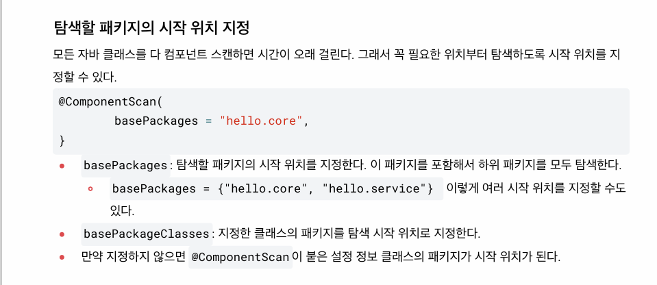

## 싱글톤 패턴
- 웹 애플리케이션은 보통 여러 고객이 동시에 요청을 한다.
- 고객 트래픽이 초당 100이 나오면 초당 100개 객체가 생성되고 소멸된다. -> 메모리 낭비가 심하다.
- 해당 객체가 딱 1개만 생성되고, 공유하도록 설계한다. -> 싱글톤 패턴

## 싱글톤 패턴
- 클래스의 인스턴스가 딱 1개만 생성되는 것을 보장하는 디자인 패턴이다.
- 싱글톤 패턴 구현
1. static 영역에 객체 instance를 미리 하나 생성해서 올려둔다.
2. 이 객체 인스턴스가 필요하면 오직 getInstance() 메서드를 통해서만 조회할 수 있다. 
이 메서드를 호출하면 항상 같은 인스턴스를 반환한다.
3. 딱 1개의 객체 인스턴스만 존재해야 하므로, 생성자를 private로 막아서 혹시라도 외부에서
new 키워드로 객체 인스턴스가 생성되는 것을 막는다.

## 싱글톤 패턴의 장단점
장점 : 이미 만들어진 객체를 공유해서 효율적으로 사용할 수 있다.
단점: 의존관계상 클라이언트가 구체 클래스에 의존하게 되어 DCP, OCP 원칙 위반.
private 생성자로 자식 클래스를 만들기 어려워 유연성이 떨어진다.

## 싱글톤 컨테이너
- 싱글톤 패턴의 문제점을 해결하면서, 객체 인스턴스를 싱글톤으로 관리한다.
- 싱글톤 객체를 생성하고 관리하는 기능을 싱글톤 레지스트리라 한다.
- 싱글톤 패턴을 적용하지 않아도, 객체 인스턴스를 싱글톤으로 관리한다.

## 싱글톤 방식의 주의점
- 여러 클라이언트가 하나의 같은 객체 인스턴스를 공유하기 때문에 싱글톤 객체는 상태를
무상태(stateless)로 설계해야 한다.
- 특정 클라이언트에 의존적인 필드, 또는 특정 클라이언트가 값을 변경할 수 있는 필드가 있으면
안 되고, 가급적 읽기만 가능해야 한다.
- 필드 대신에 자바에서 공유되지 않는 지역변수, 파라미터, ThreadLocal 등을 사용해야 한다.
- `스프링 빈의 필드에 공유 값을 설정하면 큰 장애가 발생할 수 있다.`

## 싱글톤 컨테이너에서 싱글톤이 보장되는 이유
- 내가 만든 클래스가 아니라 스프링이 cglib이라는 바이트코드 조작 라이브러리를 사용해서
AppConfig 클래스를 상속받은 임의의 다른 클래스를 만들고, 그 다른 클래스를 스프링 빈으로 등록한
것이다.
- 그 임의의 다른 클래스가 바로 싱글톤이 보장되도록 해 준다.
- @Bean이 붙은 메서드마다 이미 스프링 빈이 존재하면 존재하는 빈을 반환하고, 스프링 빈이 없으면
생성해서 스프링 빈으로 등록하고 반환하는 코드가 동적으로 만들어진다. => 싱글톤 보장
- @Bean만 사용해도 스프링 빈으로 등록되지만, 싱글톤을 보장하지 않는다.
- 스프링 설정 정보는 항상 @Configuration을 사용하자.

## 컴포넌트 스캔과 의존관계 자동 주입
- 설정 정보가 없어도 자동으로 스프링 빈을 등록하는 컴포넌트 스캔이라는 기능
- 의존관계도 자동으로 주입하는 @Autowired라는 기능을 제공한다.
- @ComponentScan은 @Component가 붙은 모든 클래스를 스프링 빈으로 등록한다.
- 
- 스프링 빈의 기본 이름은 클래스명을 사용하되 맨 앞글자만 소문자를 사용한다.
- 생성자에 @Autowired를 지정하면, 스프링 컨테이너가 자동으로 해당 스프링 빈을 찾아서 주입한다.
- 

## 탐색 위치와 기본 스캔 대상
- 
- 설정 정보를 프로젝트 최상단에 두자. 서비스 같은 곳에 넣지 말고.
- 컴포넌트 스캔 기본 대상 : @Controller, @Service, @Repository, @Configuration의 내용도
추가로 대상에 포함한다.
- @Controller : 스프링 MVC 컨트롤러로 인식
- @Repository : 스프링 데이터 접근 계층으로 인식하고, 데이터 계층의 예외를 스프링 예외로 변환해준다.
- @Configuration : 스프링 설정 정보로 인식하고, 스프링 빈이 싱글톤을 유지하도록 추가 처리한다.
- @Service : 핵심 비즈니스 계층으로 인식된다. 특별한 처리는 없음.
- 필터 : includeFilters는 컴포넌트 스캔 대상을 추가로 지정, excludeFilters는 컴포넌트 스캔에서 제외할
대상을 지정한다.

## FilterType의 5가지 옵션
1. Annotation : 기본값, 애노테이션을 인식해서 동작한다.
2. Assignable_Type : 지정한 타입과 자식 타입을 인식해서 동작한다.
3. AspectJ : AspectJ 패턴 사용
4. Regex : 정규 표현식
5. Custom : TypeFilter라는 인터페이스를 구현해서 처리
- includeFilters나 excludeFilters를 사용할 일은 거의 없음. 최근 스프링 부트는 컴포넌트 스캔을 기본으로 
제공하기 때문.

## 중복 등록과 충돌
- 컴포넌트 스캔에서 같은 빈 이름을 등록하면 어떻게 될지.
1. 자동 빈 등록 vs 자동 빈 등록
- 컴포넌트 스캔에 의해 자동으로 스프링 빈이 등록되는데, 그 이름이 같은 경우 스프링은 오류를 발생시킨다.
2. 수동 빈 등록 vs 자동 빈 등록
- 수동 빈 등록이 우선권을 가지고, 수동 빈이 자동 빈을 오버라이딩해버린다.
- 최근 스프링 부트에서는 수동 빈 등록과 자동 빈 등록이 충돌나면 오류가 발생하도록 바뀌었다.