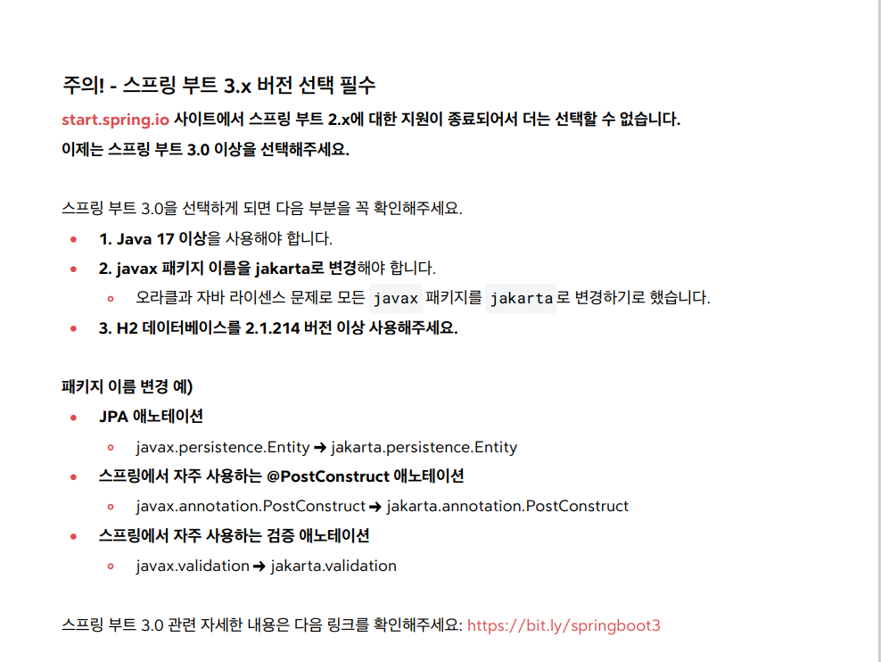
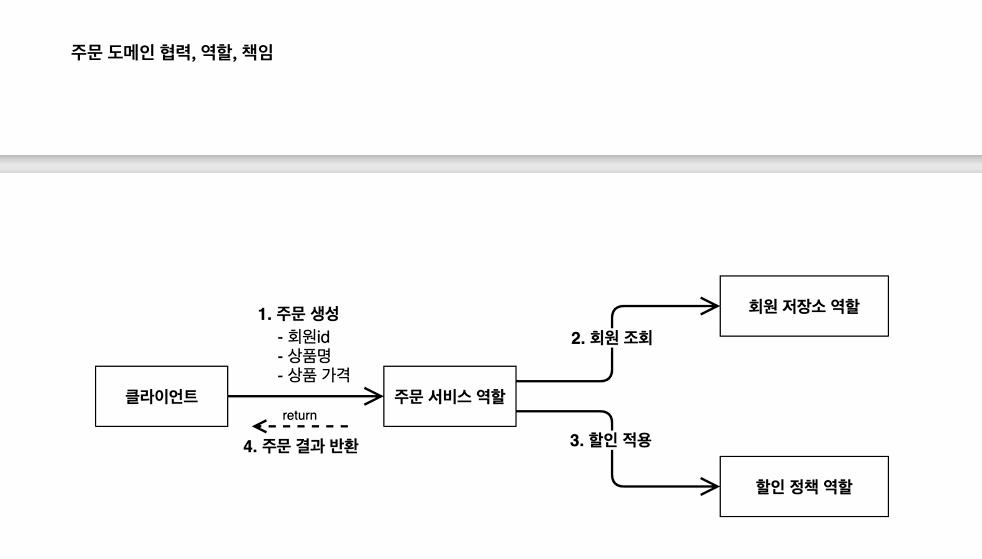
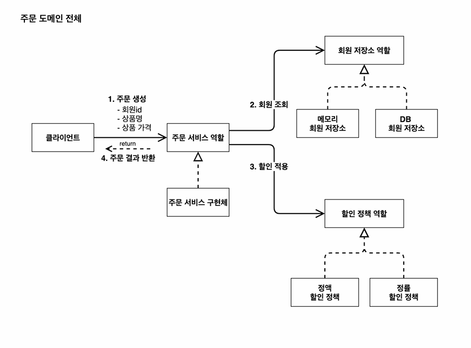

## 초기 설치
- start.spring.io에서 다운로드를 받고, 압축을 푼 뒤에 저장한다. 그 후에 그 폴더 안의
  build.gradle을 인텔리제이에서 실행하자.

## 추가 세팅
- 이제 start.spring.io에서 spring 2 버젼을 지원하지 않기에, 3 버젼에 대한 변경이 필요하다.
- 
- spring 3 버젼부터는 실행 옵션에 gradle 대신 인텔리제이 idea를 선택하면 오류가 발생한다. 
다시 gradle로 해야 함.

## 비즈니스 요구사항과 설계
1.회원
- 회원을 가입하고 조회할 수 있다. 회원은 일반과 VIP 두 등급이 있다. 회원 데이터는 자체 DB를
구축할 수 있고, 외부 시스템과 연동할 수 있다.(미확정)
2. 주문과 할인 정책
- 회원은 상품을 주문할 수 있다. 회원 등급에 따라 할인 정책을 적용할 수 있다.
- 할인 정책은 모든 VIP는 1000원을 할인해주는 고정 금액 할인을 적용해달라.(나중에 변경될 수 있음.)
- 할인 정책은 변경 가능성이 높다. 회사의 기본 할인 정책을 아직 정하지 못함.

## 개발
- 실무에서는 map 대신 hashmap을 사용하는 게 좋다.(동시성 이슈 때문)
- MemoryMemberRepository 등 리포지토리를 따로 설정함으로써 다형성을 구현하자.
- 우클릭 - Generate를 이용해서 getter, setter, 생성자 등을 손쉽게 구현할 수 있다.

## 주문 도메인 협력, 역할, 책임 다이어그램

## 주문 도메인 전체 다이어그램

- 역할과 구현을 분리해서 편리하게 개발할 수 있게 하였다.
