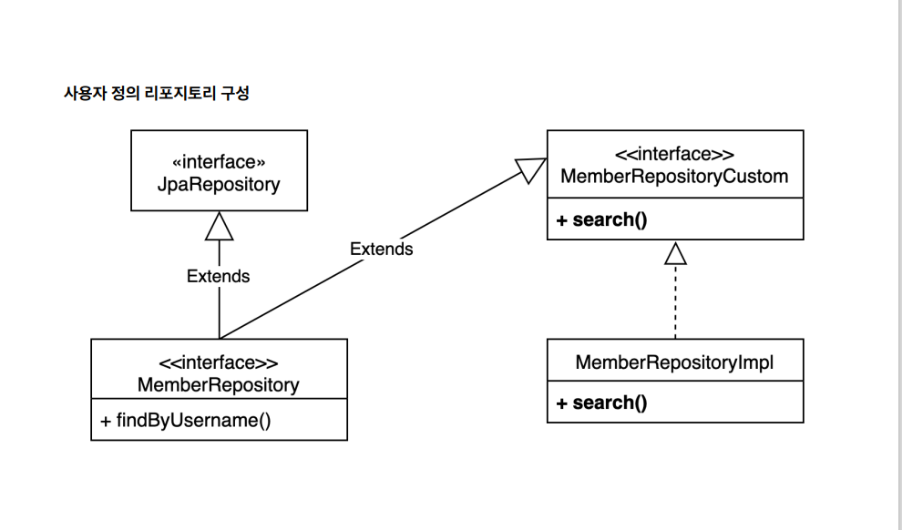
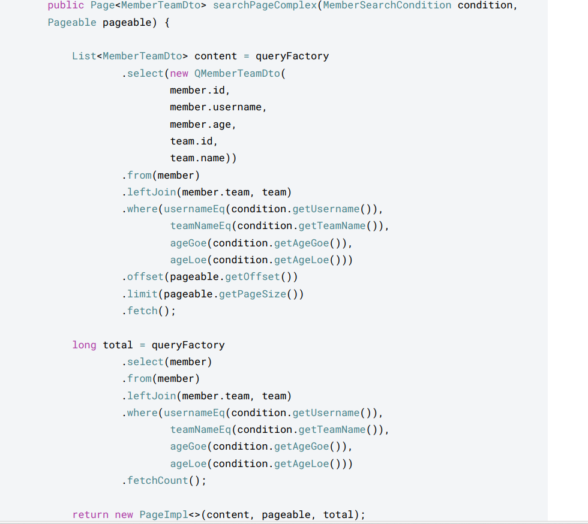

1. sql function 예시
   - member -> m으로 변경하는 replace 함수 사용
     String result = queryFactory
                               .select(Expressions.StringTemplate("function('replace', {0}, {1}, {2})", member.username, "member", "M"))
                               .from(member).fetchFirst();


2. 순수 JPA 리포지토리와 querydsl
   - 리포지토리에서 save, findBy~~, findAll 등 querydsl로 직접 구현 필요.
   - JPAQueryFactory를 스프링 빈으로 등록해서 주입받아 사용할 수도 있다.
   - 스프링이 주입해 주는 엔티티 매니저는 진짜 엔티티 매니저를 찾아주는 `가짜 프록시용 엔티티 매니저이다`.
     => 실제 사용 시점에 트랜잭션 단위로 실제 엔티티 매니저(영속성 컨텍스트)를 할당해 주기 때문에, 동시성 문제를 고려할 필요가 없음.

3. 동적 쿼리와 성능 최적화 조회 - Builder 사용
   - 1. MemberTeamDTO를 만들고, @QueryProjection 어노테이션을 추가한다.
     2. MemberSearchCondition 클래스를 선언하고, username, teamName, ageGoe, ageLoe 변수를 선언한다.
     3. BooleanBuilder 타입으로 builder를 선언하고, searchbybuilder 함수를 생성한다.

4. 동적 쿼리와 성능 최적화 조회 - where절 파라미터
   - usernameEq, teamNameEq 등을 선언해서, where절에 파라미터로 넣는다.
     ```
      private BooleanExpression usernameEq(String username) {
              return isEmpty(username) ? null : number.username.eq(username);
           }
     ```
     -> username이 null이거나 비어 있으면 null을 반환하고, 그렇지 않다면 member.username.eq(username)을 쿼리에 추가한다.
   - where 절에 파라미터를 추가하면 조건절 재사용이 가능하다.

5. 프로파일 수정 - 샘플 데이터 추가가 테스트 케이스 실행에 영향 안받게.
   - 메인에는 ``` spring:profiles:active:local  ``` 로 하고,
   - 테스트에는 ``` spring:profiles:active:test ```로 설정한다.

6. 스프링 데이터 JPA 리포지토리로 변경
    - 기본적인 스프링 데이터 JPA 리포지토리로는 Querydsl 전용 기능인 회원 search를 작성할 수 없다.
    - 사용자 정의 리포지토리 필요.
   
7. 사용자 정의 리포지토리
    1. 사용자 정의 인터페이스 작성
    2. 사용자 정의 인터페이스 구현
    3. 스프링 데이터 리포지토리에 사용자 정의 인터페이스 상속
    
    - MemberRepositoryCustom 클래스를 만들고, 이를 implement하는 MemberRepositoryImpl 클래스를
    만들어서, 여기에 where 파라미터를 이용하여 함수를 구현한다. 그리고 스프링 데이터 리포지토리에서
    사용자 정의 인터페이스를 상속한다.

8. 스프링 데이터 페이징 활용1 - Querydsl 페이징 연동
    - 스프링 데이터의 Page, Pageable을 활용하여, 전체 카운트를 한번에 조회할 수 있고, 데이터 내용과
    전체 카운트를 별도로 조회할 수도 있다.
    - 전체 카운트 한번에 조회: searchPageSimple(), fetchResults()을 사용한다.
    - Querydsl이 제공하는 fetchResults()를 사용하면 내용과 전체 카운트를 한번에 조회할 수 있다.(실제 쿼리는 2번 호출)
    - fetchResult()는 카운트 쿼리 실행시 필요없는 order by는 제거한다.

9. 데이터 내용과 전체 카운트 별도 조회

- 위와 같이, 전체 카운트를 조회하는 방법을 최적화할 수 있다.
- 스프링 데이터 라이브러리가 제공하는 CountQuery를 이용하여 최적화할 수도 있다.
    ``` 
    JPAQuery<Member> countQuery = queryFactory
                                .select(member).from(member)
                                .leftJoin(member.team, team)
                                .where(usernameEq(condition.getUsername()),
                                        teamNameEq(condition.getTeamName()),
                                        ageGoe(condition.getAgeGoe()),
                                        ageLoe(condition.getAgeLoe()));
                return PageableExecutionUtils.getPage(content, pageable,
                    countQuery::fetchCount);
    ```
- 위와 같이 함수를 만들면, count 쿼리가 생략 가능한 경우 생략해서 처리한다.
- 페이지 시작이면서 컨텐츠 사이즈가 페이지 사이즈보다 작을 때 또는 마지막 페이지일 때 생략.

10. 컨트롤러 개발

    ```
    @GetMapping("/v2/members")
    public Page<MemberTeamDto> searchMemberV2(MemberSearchCondition condition,
        Pageable pageable) {
            return memberRepository.searchPageSimple(condition, pageable);
    }
    ```
11. 스프링 데이터 정렬(sort)
- 스프링 데이터 JPA는 자신의 정렬(Sort)를 Querydsl의 정렬(OrderSpecifier)로 편리하게 변경하는 기능을
제공한다.
- 이렇게 변경하는 이유는, 일반 정렬은 조건이 조금만 복잡해져도 pageable의 sort 기능을 사용하기 어렵기 때문에,
루트 엔티티 범위를 넘어가는 동적 정렬 기능이 필요할 때 사용한다.


