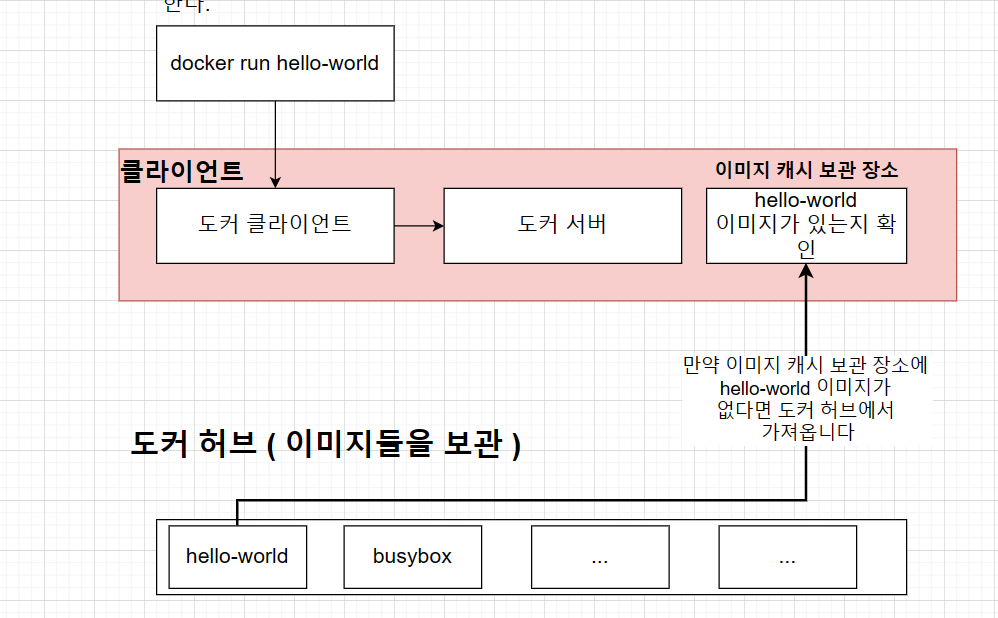
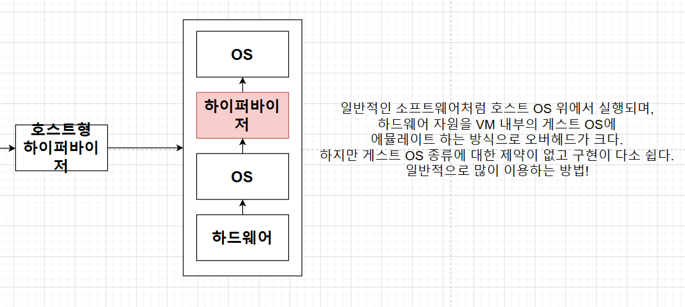
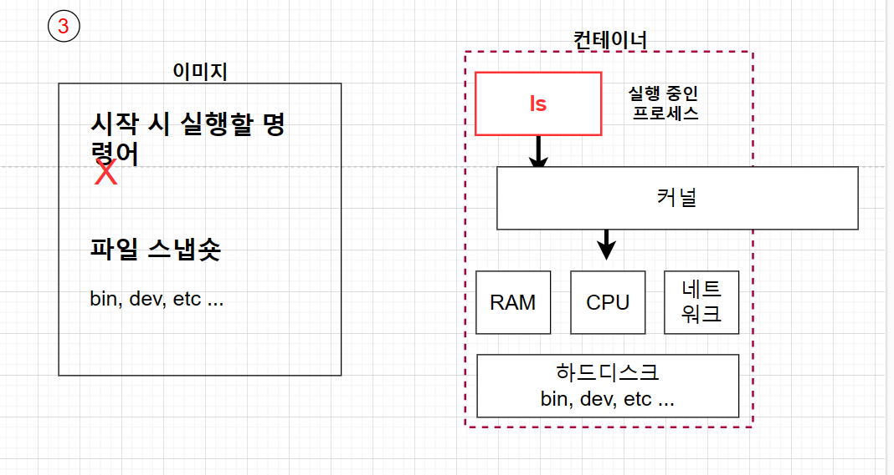
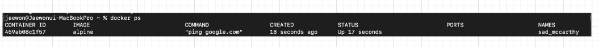

## 컨테이너
- 컨테이너 안에 다양한 프로그램, 실행환경을 컨테이너로 추상화하고, 동일한 인터페이스를 제공하여 프로그램의
배포 및 관리를 단순하게 해 준다.
- AWS, Azure, Google Cloud 등 어디서든 실행 가능하게 해 준다.

## 컨테이너 이미지
- 코드, 런타임, 시스템 설정 둥의 응용 프로그램을 실행하는 데 필요한 모든 것을 포함하는 소프트웨어 패키지.
- 도커 이미지는 프로그램을 실행하는 데 필요한 설정이나 종속성을 가짐, 도커 이미지를 이용해서 컨테이너를 생성하며 도커 컨테이너를 이용하여
프로그램을 실행한다.

## 도커를 사용할 때의 흐름

1. 도커 클라이언트에 커맨드 입력해서 클라이언트에서 도커 서버로 요청 보냄
2. 서버에서 hello-world라는 이미지가 로컬에 캐시되어있는지 확인
3. 없다면 도커 허브라는, 이미지 저장 장소로 가서 이미지를 가져오고 로컬에 캐시로 보관
4. 가져온 이미지를 이용하여 컨테이너 생성

## 도커와 기존의 가상화 기술과의 차이를 통한 컨테이너 이해
1. 가상화 기술 나오기 전
- 하나의 서버에 하나의 운영체제, 하나의 프로그램..  비효율적

2. 가상화 기술 이후
- 논리적으로 공간을 분할하여 VM이라는 독립적인 가상 환경의 서버 이용 가능.
- 하이퍼바이저는 호스트 시스템에서 다수의 게스트 OS를 구동할 수 있게 하는 소프트웨어, 그리고 
하드웨어를 가상화하면서 하드웨어와 각각의 VM을 모니터링하는 중간 관리자.

- 하이퍼바이저에 의해 구동되는 VM은 각 VM마다 독립된 가상 하드웨어 자원을 할당받는다.

3. 도커와 기존 가상화 기술의 차이
- 
- VM과 비교할때 컨테이너는 하이퍼바이저와 게스트OS가 필요하지 않으므로 더 가볍다.
- 어플리케이션을 실행할 때 컨테이너 방식: 호스트 OS위에 애플리케이션의 실행 패키지인 이미지를 배포하면 된다.
- VM 방식: VM을 띄우고 자원을 할당한 후 게스트 OS를 부팅하여 애플리케이션을 실행해야 해서 훨씬 무겁다.
- 차이점
- 1. 도커 컨테이너에서 돌아가는 애플리케이션은 같은 호스트의 다른 컨테이너와 동일한 커널을 공유한다. 따라서 컨테이너 내부에서 실행되는
프로세스는 호스트 시스템에서 볼 수 있다. EX) 도커와 함께 몽고DB 컨테이너 실행하면 컨테이너가 전체 OS 내장할 필요가 없어 5-100MB(매우 가벼움)
- 2. 가상 머신과 함께 VM 내부에서 실행되는 호스트 운영 체제 또는 하이퍼바이저와 완전히 독립되어 있다. 따라서 시작 시간에 이 VM
환경을 위해 커널을 새로 부팅하고 운영 체제 프로세스 세트를 시작해야 한다. 따라서 일반적인 컨테이너보다 VM의 크기가 훨씬 크다.

4. 도커 컨테이너를 격리시키는 방법
- 리눅스 커널의 기능인 Cgroup과 네임스페이스를 이용하여, 컨테이너와 호스트에서 실행되는 다른 프로세스 사이에 벽을 만든다.
- 1. C group
- - CPU, apahfl, HD I/O 등 프로세스 그룹의 시스템 리소스 사용량을 관리한다.
- 어떤 어플이 사용량이 너무 많으면 그것을 C group에 집어넣어서 CPU와 메모리 사용 제한 가능
- 2. 네임스페이스
- - 하나의 시스템에서 프로세스를 격리시킬 수 있는 가상화 기술, 별개의 독립된 공간을 사용하는 것처럼 격리된 환경 제공

5. 이미지로 컨테이너를 만드는 법
- 1. 파일 스냅샷: 파일을 실행하는 데 필요한 파일, 디렉토리나 파일을 카피한 것
- 2. Docker 클라이언트에 docker run <이미지> 입력해 준다.
- 3. 도커 이미지에 있는 파일 스냅샷을 컨테이너 하드 디스크에 옮겨 준다.
- 4. 이미지에서 가지고 있는 명령어(컨테이너가 실행될 때 사용될 명령어)를 이용하여 파일 실행

6. 도커 명령어의 작동 방식
- ex) docker run alpine ls 명령어를 실행했을 경우
- 1. alpine 이미지를 이용하여 컨테이너 생성
- 2. 생성할 때 alpine 이미지 안에 들어 있던 파일 스냅샷들이 컨테이너 안에 있는 하드 디스크로 다운로드
- 3. 이미지 이름 뒤에 다른 명령어를 더 붙였으므로, 원래 이미지 안에 들어 있는 기본 커맨드는 무시가 되고
ls 명령어가 실행된다.

7. 컨테이너 나열

- 1. Container ID : 컨테이너의 고유한 ID 해쉬값
- 2. Image : 컨테이너 생성 시 사용한 도커 이미지
- 3. Command : 컨테이너 시작 시 실행될 명령어
- 4. Created : 컨테이너가 생성된 시간
- 5. Status : 컨테이너의 상태. 실행 중은 Up, 종료는 Exited, 일시정지는 Pause
- 6. Ports : 컨테이너가 개방한 포트와 호스트에 연결한 포트
- 7. Names : 컨테이너의 고유한 이름. 컨테이너 생성 시 --name으로 직접 이름을 설정하지 않으면 도커 엔진이
조합하여 설정.
- 모든 컨테이너(종료된 것까지) 나열: docker ps -a

