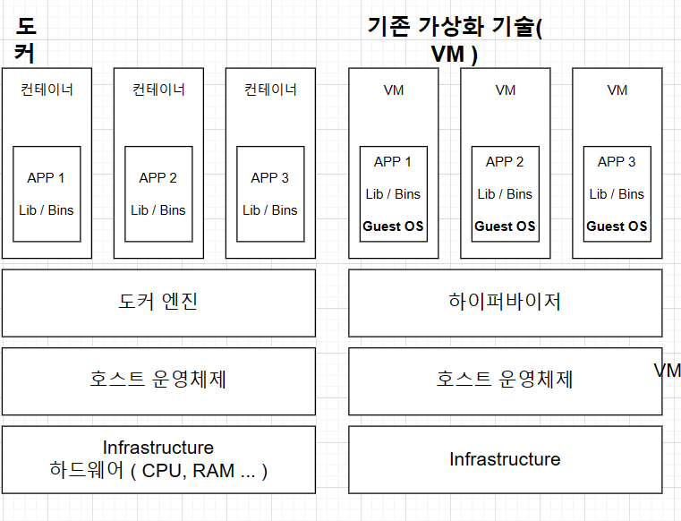
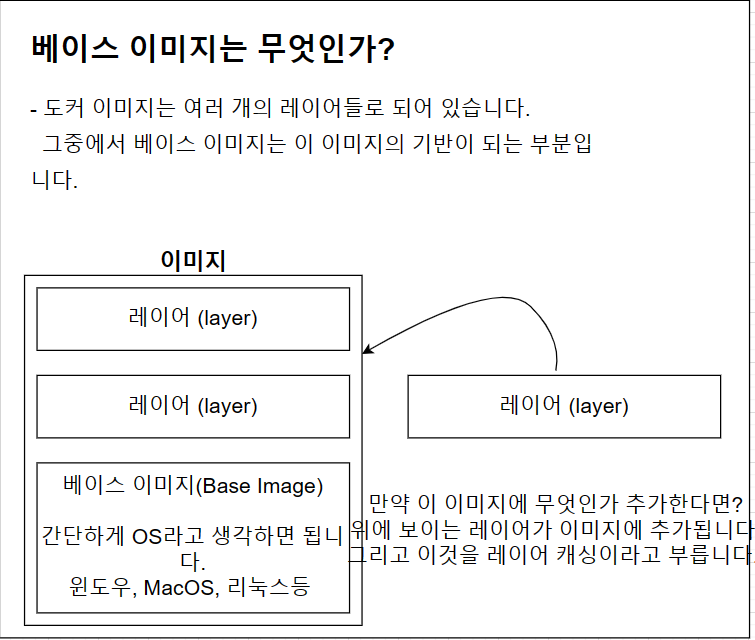
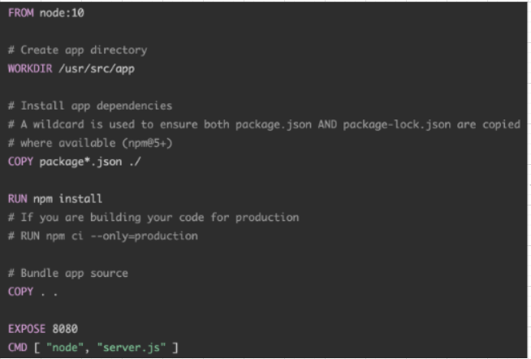

## 컨테이너
- 컨테이너 안에 다양한 프로그램, 실행환경을 컨테이너로 추상화하고, 동일한 인터페이스를 제공하여 프로그램의
배포 및 관리를 단순하게 해 준다.
- AWS, Azure, Google Cloud 등 어디서든 실행 가능하게 해 준다.

## 컨테이너 이미지
- 코드, 런타임, 시스템 설정 둥의 응용 프로그램을 실행하는 데 필요한 모든 것을 포함하는 소프트웨어 패키지.
- 도커 이미지는 프로그램을 실행하는 데 필요한 설정이나 종속성을 가짐, 도커 이미지를 이용해서 컨테이너를 생성하며 도커 컨테이너를 이용하여
프로그램을 실행한다.

## 도커를 사용할 때의 흐름

1. 도커 클라이언트에 커맨드 입력해서 클라이언트에서 도커 서버로 요청 보냄
2. 서버에서 hello-world라는 이미지가 로컬에 캐시되어있는지 확인
3. 없다면 도커 허브라는, 이미지 저장 장소로 가서 이미지를 가져오고 로컬에 캐시로 보관
4. 가져온 이미지를 이용하여 컨테이너 생성

## 도커와 기존의 가상화 기술과의 차이를 통한 컨테이너 이해
1. 가상화 기술 나오기 전
- 하나의 서버에 하나의 운영체제, 하나의 프로그램..  비효율적

2. 가상화 기술 이후
- 논리적으로 공간을 분할하여 VM이라는 독립적인 가상 환경의 서버 이용 가능.
- 하이퍼바이저는 호스트 시스템에서 다수의 게스트 OS를 구동할 수 있게 하는 소프트웨어, 그리고 
하드웨어를 가상화하면서 하드웨어와 각각의 VM을 모니터링하는 중간 관리자.

- 하이퍼바이저에 의해 구동되는 VM은 각 VM마다 독립된 가상 하드웨어 자원을 할당받는다.

3. 도커와 기존 가상화 기술의 차이
- 
- VM과 비교할때 컨테이너는 하이퍼바이저와 게스트OS가 필요하지 않으므로 더 가볍다.
- 어플리케이션을 실행할 때 컨테이너 방식: 호스트 OS위에 애플리케이션의 실행 패키지인 이미지를 배포하면 된다.
- VM 방식: VM을 띄우고 자원을 할당한 후 게스트 OS를 부팅하여 애플리케이션을 실행해야 해서 훨씬 무겁다.
- 차이점
- 1. 도커 컨테이너에서 돌아가는 애플리케이션은 같은 호스트의 다른 컨테이너와 동일한 커널을 공유한다. 따라서 컨테이너 내부에서 실행되는
프로세스는 호스트 시스템에서 볼 수 있다. EX) 도커와 함께 몽고DB 컨테이너 실행하면 컨테이너가 전체 OS 내장할 필요가 없어 5-100MB(매우 가벼움)
- 2. 가상 머신과 함께 VM 내부에서 실행되는 호스트 운영 체제 또는 하이퍼바이저와 완전히 독립되어 있다. 따라서 시작 시간에 이 VM
환경을 위해 커널을 새로 부팅하고 운영 체제 프로세스 세트를 시작해야 한다. 따라서 일반적인 컨테이너보다 VM의 크기가 훨씬 크다.

4. 도커 컨테이너를 격리시키는 방법
- 리눅스 커널의 기능인 Cgroup과 네임스페이스를 이용하여, 컨테이너와 호스트에서 실행되는 다른 프로세스 사이에 벽을 만든다.
- 1. C group
- - CPU, apahfl, HD I/O 등 프로세스 그룹의 시스템 리소스 사용량을 관리한다.
- 어떤 어플이 사용량이 너무 많으면 그것을 C group에 집어넣어서 CPU와 메모리 사용 제한 가능
- 2. 네임스페이스
- - 하나의 시스템에서 프로세스를 격리시킬 수 있는 가상화 기술, 별개의 독립된 공간을 사용하는 것처럼 격리된 환경 제공

5. 이미지로 컨테이너를 만드는 법
- 1. 파일 스냅샷: 파일을 실행하는 데 필요한 파일, 디렉토리나 파일을 카피한 것
- 2. Docker 클라이언트에 docker run <이미지> 입력해 준다.
- 3. 도커 이미지에 있는 파일 스냅샷을 컨테이너 하드 디스크에 옮겨 준다.
- 4. 이미지에서 가지고 있는 명령어(컨테이너가 실행될 때 사용될 명령어)를 이용하여 파일 실행

6. 도커 명령어의 작동 방식
- ex) docker run alpine ls 명령어를 실행했을 경우
- 1. alpine 이미지를 이용하여 컨테이너 생성
- 2. 생성할 때 alpine 이미지 안에 들어 있던 파일 스냅샷들이 컨테이너 안에 있는 하드 디스크로 다운로드
- 3. 이미지 이름 뒤에 다른 명령어를 더 붙였으므로, 원래 이미지 안에 들어 있는 기본 커맨드는 무시가 되고
ls 명령어가 실행된다.

7. 컨테이너 나열

- 1. Container ID : 컨테이너의 고유한 ID 해쉬값
- 2. Image : 컨테이너 생성 시 사용한 도커 이미지
- 3. Command : 컨테이너 시작 시 실행될 명령어
- 4. Created : 컨테이너가 생성된 시간
- 5. Status : 컨테이너의 상태. 실행 중은 Up, 종료는 Exited, 일시정지는 Pause
- 6. Ports : 컨테이너가 개방한 포트와 호스트에 연결한 포트
- 7. Names : 컨테이너의 고유한 이름. 컨테이너 생성 시 --name으로 직접 이름을 설정하지 않으면 도커 엔진이
조합하여 설정.
- 모든 컨테이너(종료된 것까지) 나열: docker ps -a

8. 도커의 생명 주기

- docker start에 -a 옵션을 붙여서 시작하게 만든다.

9. docker stop과 docker kill의 차이점
- stop은 자비롭게 그동안 하던 작업들을, 메시지를 보내고 있었다면 보내고 있던 메시지를 완료하고 컨테이너를 중지시킨다. SigTerm 명령어를 사용하여
중지시키며 grace period라는, 정리하는 시간을 가지고 중지한다.
- kill은 어떠한 것도 기다리지 않고, sigkill 명령어를 이용하여 컨테이너를 중지시킨다.

10. 컨테이너 삭제
- 중지된 컨테이너 삭제하는 방법 : docker rm <아이디/이름>
- 모든 컨테이너 삭제 : docker rm $(docker ps -aq) : PowerShell or Git Bash에서만 작동
- 이미지 삭제 : docker rmi <이미지 id>
- 한번에 컨테이너, 이미지, 네트워크 모두 삭제 : docker system prune, 실행 중인 컨테이너에는 영향X

11. 명령어 실행
- 실행 중인 컨테이너에 명령어 전달 : docker exec <컨테이너 아이디>
- docker exec -it 컨테이너 아이디 sh : 명령어를 계속해서 입력할 수 있다.
- 터미널 환경에서 나오려면 ctrl + d 입력하면 된다.

12. 도커 이미지 만들기
- docker create <이미지이름>
- 도커 이미지 생성하는 순서
- dockerfile 작성 -> 도커 클라이언트 -> 도커 서버 -> 이미지 생성

13. dockerfile이란
- 도커 이미지를 만들기 위한 설정 파일이며, 컨테이너가 어떻게 행동해야 하는지에 대한 설정 파일을
제공해 주는 곳이다.
- 도커 파일 만드는 순서
- 1. 베이스 이미지를 명시해 준다.(파일 스냅샷에 해당)
- 2. 추가적으로 필요한 파일을 다운받기 위한 몇가지 명령어를 명시해 준다.

- dockerfile 만들기 실습 과정
- 1. 도커 파일을 만들 폴더 하나 만들기
- 2. 방금 생성한 도커 파일 폴더를 에디터를 이용하여 실행.(visual studio code 사용하였음.)
- 3. 파일 하나를 생성, 이름은 dockerfile로 생성
- 4. 그 안에서 어떻게 진행해 나갈지 설정
- 5. FROM : 이미지 생성 시 기반이 되는 이미지 레이어. <이미지 이름> <태그> 형식으로 작성.
- 6. RUN: 도커 이미지가 생성되기 전에 수행할 쉘 명령어 (추가적으로 필요한 파일 다운로드)
- 7. CMD: 컨테이너가 시작되었을 때 실행할 실행 파일 또는 셸 스크립트. 해당 명령어는 dockerfile 내 1회만 쓸 수 있다.

14. 도커 파일로 도커 이미지 만들기
- `docker build ./` 명령어로 만든다.
- 베이스 이미지에서 다른 종속성이나 새로운 커맨드를 추가할 때는 임시 컨테이너를 만든 후 그 컨테이너를 토대로 새로운 이미지를 만든다.
임시 컨테이너는 지워 준다.

15. 이미지의 이름 생성
- `docker build -t injoon/hello:latest ./` 명령어를 이용해 도커 이미지에 이름을 줄 수 있다.
- `docker build ./` 대신 `docker build -t 이미지 이름 ./`을 사용하는 것.

16. node.js 어플을 도커 환경에서 실행
- node.js 어플을 도커 환경에서 실행하려면 먼저 이미지를 생성하고 그 이미지를 이용하여 컨테이너를 실행한 후 그 컨테이너 안에서 nodejs 앱을
실행해야 한다. => 이미지를 생성하기 위해 먼저 dockerfile 작성 필요.

17. dockerfile 생성

- npm은 node.js로 만들어진 모듈을 웹에서 받아서 설치하고 관리해 주는 프로그램이다.
- npm install은 package.json에 적혀 있는 종속성들을 웹에서 자동으로 다운받아서 설치해주는 명령어이다.
- dockerfile을 작성한 후에는, 그 파일로 이동해서 `docker build ./` 명령어를 통해서 dockerfile의 내용을 docker 서버로 이동해서 
이미지를 생성한다.

18. 트러블슈팅
- 1. 이미지를 빌드할 때 package.json이나 server.js 파일이 없다고 나올 때
-> 도커 파일을 빌드할 때는 node 베이스 이미지로 임시 컨테이너를 생성한다. 그리고 그 컨테이너로 이미지를 만든다. 그러나 임시 컨테이너에는 
package.json이 node 이미지 파일 스냅샷에 포함되어 있지 않다. 따라서 copy 명령어로 그 파일들을 컨테이너 안으로 넣어 주어야 한다.
- 
- `COPY package.json ./` `COPY server.js ./`
- `docker build -t docker-practice ./` 이후 `docker run docker-practice`로 실행.

19. 트러블슈팅 2
- 2. 애플리케이션 실행 시 접근이 안 되는 이유
-> 결론부터 말하자면 `docker run 이미지이름` 명령어 대신 `docker run -p 5000:8080 이미지 이름` 이런 식으로 명령어를 사용해 주었어야 했다.
- 새롭게 추가된 부분: 위에 로컬에 있던 파일을 컨테이너에 복사해 주었던 것처럼 네트워크도 로컬 네트워크에 있던 것을 컨테이너 내부에 있는 
네트워크로 연결을 시켜 주어야 한다.

- 위 명령어를 사용하면 localhost:5000 으로 접속하면 접속이 된다.

20. working directory 명시해 주기
- working directory: 이미지 안에서 애플리케이션 소스 코드를 가지고 있을 디렉터리를 생성하는 것.
- workdir을 지정하지 않고 그냥 COPY할 때 생기는 문제점
- 1. 새로 추가되는 파일 중에 원래 이미지에 있던 파일과 이름이 같을 시 원래 있던 폴더가 덮어써져 버린다.
- 2. 모든 파일이 한 디렉터리에 들어가 버려서 정리를 할 수 없다.
- 
- 위와 같이 새로운 dockerfile로 이미지를 다시 생성 후
- `docker run -it <이미지 이름> sh` 명령어로 터미널을 킨다. 
- 
- 위 사진과 같은 상태가 되었다.

21. 어플리케이션 소스 변경 시 재빌드 효율적으로 하는 법
- 문제점 : 현재는 어플리케이션 소스를 변경하면, docker build -t를 통해 도커 파일로 도커 이미지를 생성하고, docker run을 통해
도커 이미지로 컨테이너 생성 후 앱을 실행하는 방식을 반복해야 한다.
- 
- 
- 위의 도표를 보면 Run 위에 COPY package.json ./이 추가되고 원래의 copy가 run 아래로 내려갔다.
- npm install을 할 떄 불필요한 다운로드를 피하기 위해서이다.
- 이렇게 하면 모듈은 모듈에 변화가 있을 때만(dockerfile) 다운로드를 하며, 변화가 없으면 cache를 사용해서 빌드를 빠르게 한다.

22. 주의사항
- 맥에서
-v $(pwd):/usr/src/app
윈도우에서
-v %cd%:/usr/src/app
이런 식으로 다르게      $(pwd) => %cd% 이렇게 다르게 사용해주시면 됩니다 

23. docker volume 사용하는 법
- 지금까지는 소스를 변경할 때마다 변경된 소스 부분을 copy 한 후 이미지를 다시 빌드 후 컨테이너를 다시 실행해 주어야 한다.
-  
- volume을 이용해서 docker를 run하면 소스 코드의 내용을 복사가 아니라 참조의 방식으로 진행하기 때문에, 소스 코드를 변경하면 바로바로 반영이 된다.
- 
- `docker run -d -p 5000:8080 -v /usr/src/app/node_modules -v %cd%:/usr/src/app docker-practice`
위 명령어를 통해 도커 볼륨을 이용하여 실행하였다.
- 소스 코드를 변경하고, docker ps를 통해 컨테이너 아이디를 확인한 뒤 docker stop을 통해 이를 중지하고, 위 명령어를 통해 
다시 run하면 변경된 소스 코드의 내용이 바로 반영되는 것을 알 수 있다.

