## Docker Compose
- 다중 컨테이너 도커 애플리케이션을 정의하고 실행하기 위한 도구

## Redis
- 메모리 기반의 키-값 구조 데이터 관리 시스템으로, 모든 데이터를 메모리에 저장한다.
- 메모리에 저장하기 때문에 Mysql 같은 데이터베이스에 데이터를 저장하는 것보다 데이터를 불러올 때 훨씬 
빠르게 처리할 수 있으며, 영속적으로 보관이 가능하다.
- 서버를 재부팅해도 데이터를 유지할 수 있는 장점이 있다.

## 어플리케이션 소스코드 작성
- 새로운 폴더를 하나 만들고, npm init으로 package.json과 server.js 작성을 마친다.
- 노드 코드를 작성한다.
- 주의사항: 도커 환경에서 레디스 클라이언트 생성 시 주의사항
- 보통 도커를 사용하지 않는 환경에서는 redis 서버가 작동되고 있는 곳의 host 옵션을 url로 주면 되지만,
도커 compose를 사용할 때는 host 옵션을 docker-compose.yml 파일에 명시한 컨테이너 이름으로 주면 된다.
- 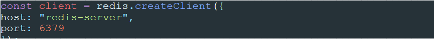

## 도커 컨테이너 간 통신 시 나타나는 에러
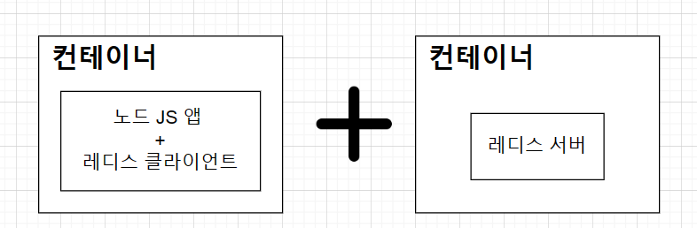 : 어플의 동작 과정
- 레디스 클라이언트가 작동하려면 레디스 서버가 켜져 있어야 하기 때문에 레디스 서버를 위한 컨테이너를 실행하고,
또 다른 컨테이너 속 레디스 클라이언트를 실행해야 한다.
- 하지만 서로 다른 컨테이너 사이에는 아무런 설정 없이는 통신할 수 없다.
- 이 때 사용 가능한 도구 : `Docker Compose` : 멀티 컨테이너 상황에서 쉽게 네트워크를 연결시켜 준다.

## Docker-compose 사용
- Dockerfile을 생성했던 디렉터리와 같은 디렉터리에 docker-compose.yml 파일을 생성한다.
- yml 파일 : 일반적으로 구성 파일 및 데이터가 저장되거나 전송되는 응용 프로그램에서 사용되고, 원래는 xml이나 json 포맷으로
많이 쓰였지만 좀 더 사람이 읽기 쉬운 포맷으로 나타낸 게 yml이다.
- 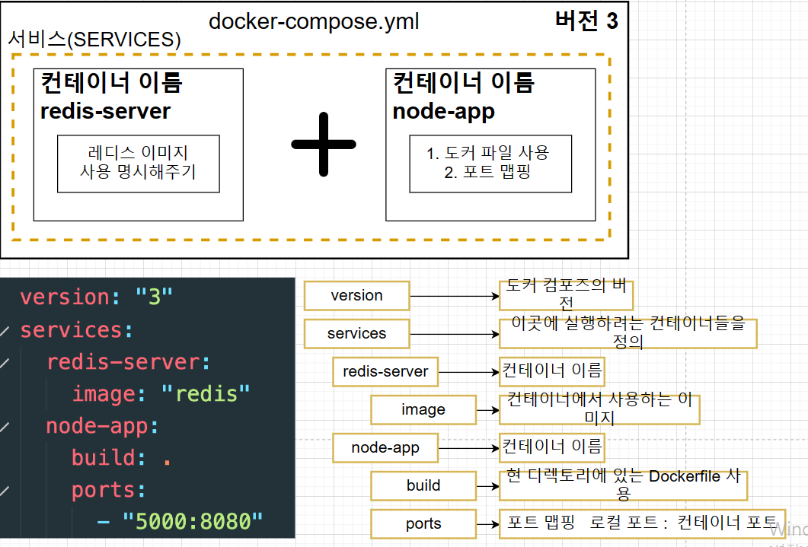
- 위 사진과 같이 docker-compose.yml 파일을 생성한다.

## Docker-compose 를 사용하는 빌드/중단
- `docker-compose up -d --build` 명령어를 사용하면, 하나의 터미널에서 앱을 작동시키고 중단시킬 수 있다.
- `-d 옵션` : detached 모드로서, 앱을 백그라운드에서 실행시킨다. 그래서 앱에서 나오는 output을 출력하지 않는다.
- `docker-compose down` : docker-compose를 사용하는 빌드를 중단시킨다.

## React 앱 설치하기
- 리액트를 파일에 설치하기 위한 명령어
- `npm init`, `npm install create-react-app`, `npx create-react-app myapp` 순으로 명령어 작성.
- 리액트 애플리케이션 실행 : `npm run start`
- 개발한 것에 문제없는지 테스트: `npm run test`
- 배포를 위한 명령어 : `npm run build`
- 위처럼 하면 위 명령어를 myapp으로 가서 실행해야 한다.(중요)

## 도커를 이용하여 리액트 앱 실행
- 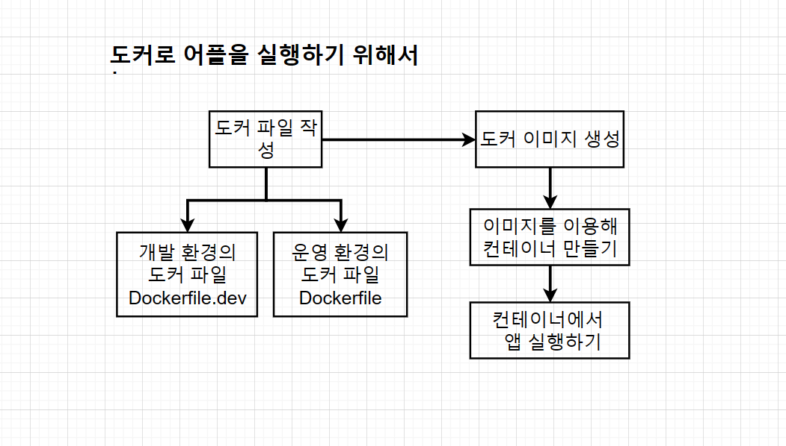
- 개발 단계를 위한 dockerfile과 운영 환경(배포 후)을 위한 dockerfile을 구분해 주는게 좋다.
- 개발 단계를 위해 dockerfile.dev 라는 파일을 생성하면, 에러가 뜰 수 있다.
- 원래 이미지를 빌드할 때 해당 디렉토리만 정해주면 dockerfile을 찾아서 빌드하는데 현재는 dockerfile이 없고 dockerfile.dev밖에 없기 때문.
- 이 때는 빌드할 때 `docker build -f dockerfile.dev .` 명령어를 통해 빌드해야 한다.
- 추가 팁 : 로컬 머신에 node_modules 폴더가 있는데, 이미지를 빌드할 때 이미 npm install로 node_modules을 포함한 모든 모듈을 다운받기 때문에
굳이 로컬 머신에 node_modules을 필요로 하지 않아, 빌드 시간을 줄이기 위해 이를 삭제하는 게 좋다.
- 이미지 이름까지 해서 빌드: `docker build -f dockerfile.dev ./ -t injoonimage `

## 도커 이미지로 리액트 앱 실행
- `docker run -itp 3000:3000 이미지 이름` 명령어로 리액트 앱을 실행하고, localhost:3000으로 접속한다.
- 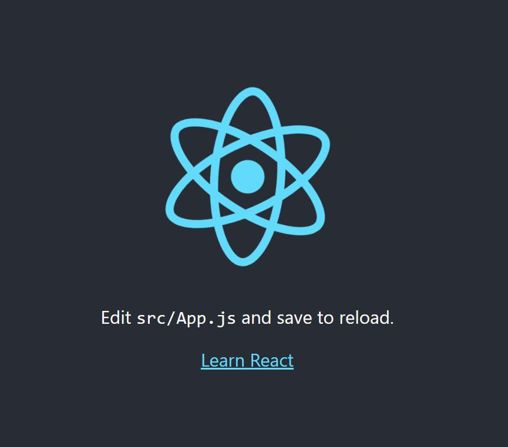

## 도커 볼륨을 이용한 소스 코드 변경
- 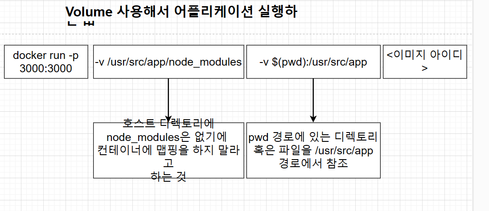
- 위 명령어를 통해 빌드한다.
- `docker run -itp 3000:3000 -v /usr/src/app/node_modules -v $(pwd)/usr/src/app injoonimage`

## 도커 컴포즈로 간단하게 앱 실행하기
- 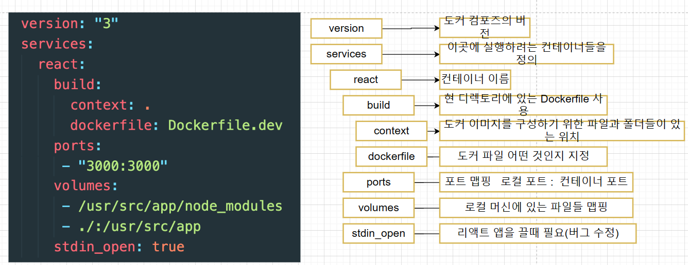
- `docker-compose up` 명령어를 통해 앱을 실행한다.

## 트러블슈팅
- 윈도우 환경 도커 볼륨 소스 코드 변경이 반영이 안될때
- 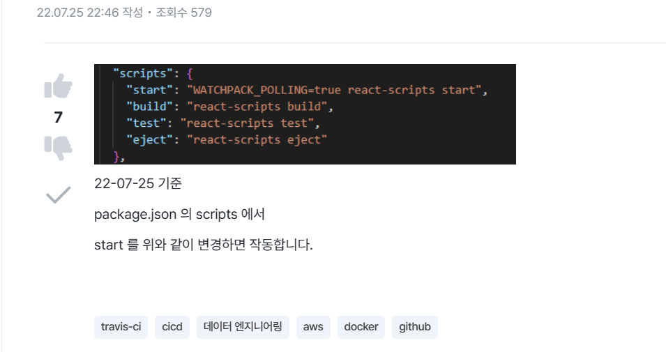

## 테스트
- 테스트도 소스 코드 변경하면 자동으로 반영되도록 하자.
- 테스트를 위한 컨테이너를 compose 파일에 하나 더 만들어 준다.
- docker-compose.yml에 이 부분을 추가한다.
- 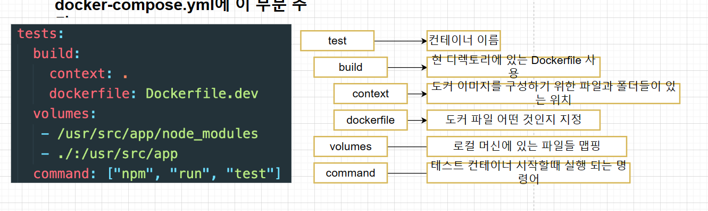

## 운영환경을 위한 Nginx
- Nginx를 운영환경에서 사용하는 이유
- 개발에서 사용하는 서버는 소스를 변경하면 자동으로 전체 앱을 다시 빌드해서 변경 소스를 반영해 주는 것 같이 개발 환경에 특화된 기능들이
있기에 그러한 기능이 없는 nginx 서버보다 사용하기에 적합하다.
- 운영 환경에서는 소스를 변경할 때 다시 반영해 줄 필요가 없으며 개발에 필요한 기능들이 필요하지 않기에 더 깔끔하고 빠른 nginx 서버를 사용한다.

## 운영환경 도커 이미지 위한 Dockerfile 작성하기
- 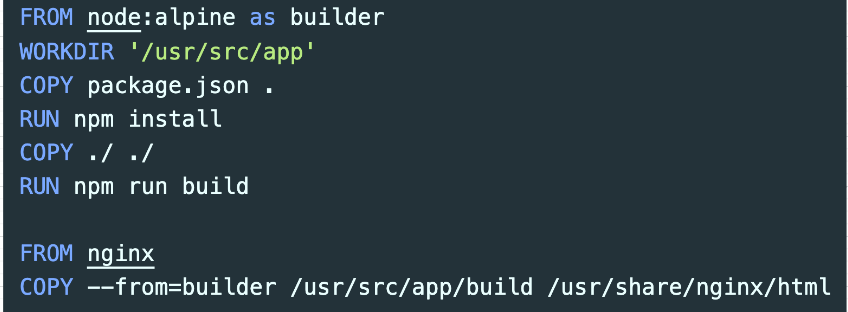
- 첫 번째 단계는 빌드 파일들을 생성하고, 두 번째 단계는 nginx를 가동하고 첫 번째 단계에서 생성된 빌드 폴더의 파일들을 웹 브라우저의
요청에 따라 제공하여 준다.
- 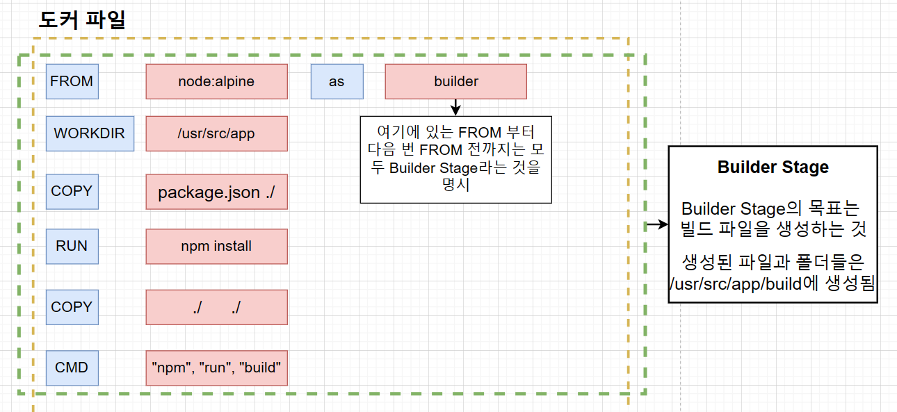
- 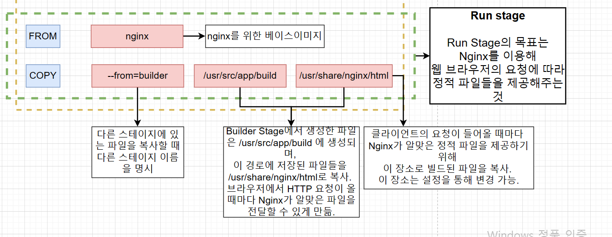
- 위처럼 다 했다면 다 작성된 Dockerfile로 이미지를 생성하고, 실행한다.
- `docker build -t 이미지이름 .`
- `docker run -p 8080:80 이미지이름`

## 간단한 어플 실제로 배포하기
- 개발환경에서 개발 -> 깃허브에 코드를 푸시 -> Travis CI에서 마스터 브랜치에 푸시된 코드를 가져감 ->
테스트가 성공하면 호스팅 사이트로 보내서 배포를 한다.
1. 깃허브에 리포지토리를 새로 생성하고, git init, git add ., git commit -m "first commit" 등 명령어를 통해 깃허브에 연결한다.

## Travis CI
- 깃허브에서 진행되는 오픈소스 프로젝트를 위한 CI 서비스이다.
- 깃허브 리포지토리에 있는 프로젝트를 특정 이벤트에 따라 자동으로 테스트, 빌드, 배포할 수 있다.
- 로컬 Git -> 깃허브 -> Travis CI -> AWS
