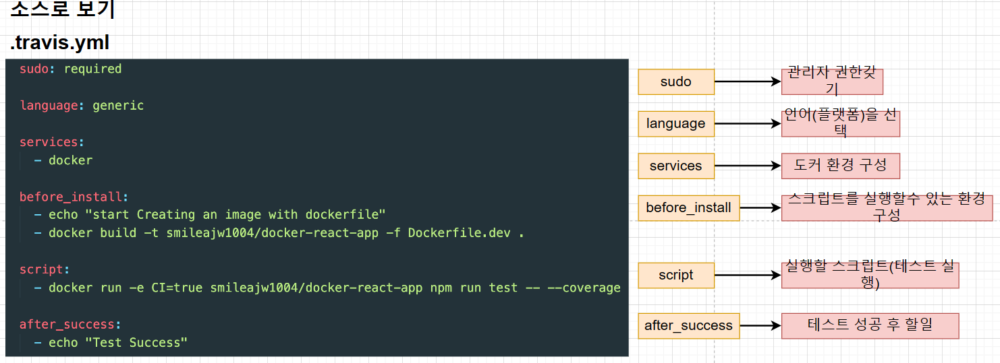

## .travis.ci 파일
- 깃허브에서 travis.ci로 소스를 어떻게 전달시키며, 전달받은 것을 어떻게 테스트하며, 그 테스트가 성공했을 때 어떻게
aws에 전달해서 배포를 할 것인지를 적어 놓은 명령어 파일.
- 
- sudo : 관리자 권한 갖기
- language : 언어, 플랫폼 선택
- services : 도커 환경 구성
- before_install : 스크립트를 실행할 수 있는 환경 구성.
- script : 실행할 스크립트
- after_success : 테스트 성공 후 할 일

## 소스코드 깃헙에 다시 배포.
- 소스 코드 변환 -> git add . -> git commit -m "내용" -> git push origin master

