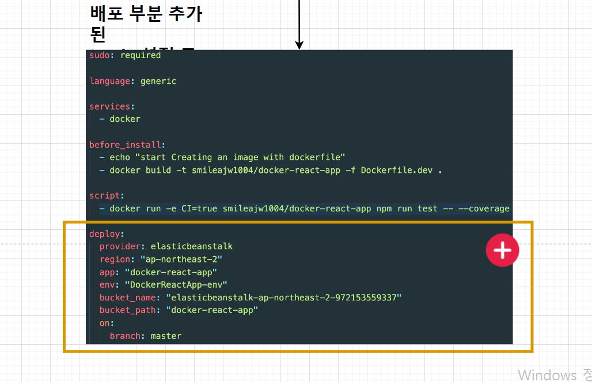
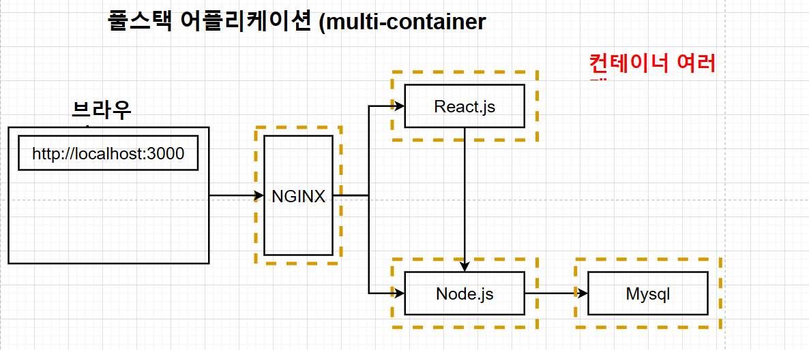
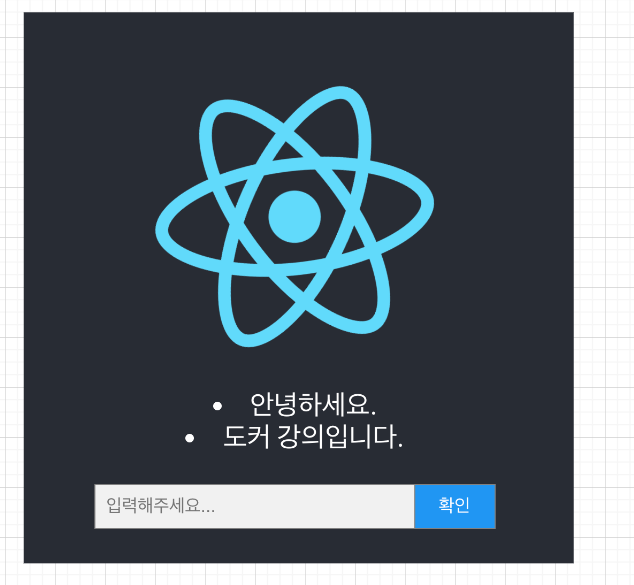
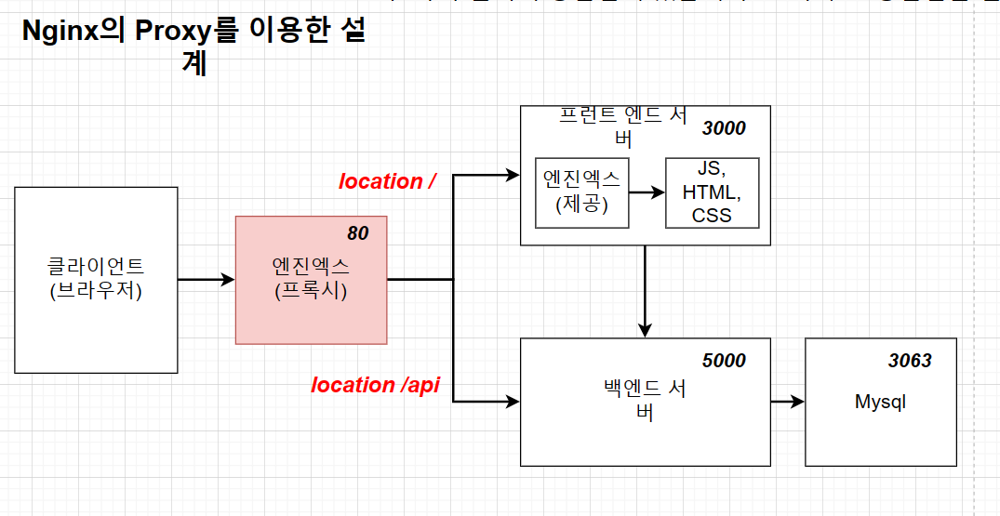

## .travis.ci 파일
- 깃허브에서 travis.ci로 소스를 어떻게 전달시키며, 전달받은 것을 어떻게 테스트하며, 그 테스트가 성공했을 때 어떻게
aws에 전달해서 배포를 할 것인지를 적어 놓은 명령어 파일.
- 
- sudo : 관리자 권한 갖기
- language : 언어, 플랫폼 선택
- services : 도커 환경 구성
- before_install : 스크립트를 실행할 수 있는 환경 구성.
- script : 실행할 스크립트
- after_success : 테스트 성공 후 할 일

## 소스코드 깃헙에 다시 배포.
- 소스 코드 변환 -> git add . -> git commit -m "내용" -> git push origin master

## Elastic Beanstalk
- apache, nginx 같은 친숙한 서버에서 java,net,php 등 및 docker와 함께 개발된 웹 응용 프로그램 및 서비스를
배포하고 확장하기 쉬운 서비스이다.
- ec2 인스턴스나 데이터베이스와 같이 많은 것을 포함한 환경을 구성하며 만들고 있는 소프트웨어를 업데이트할 때마다 
자동으로 이 환경을 관리해 준다.

## .travis.ci 파일 작성
- 
- 새롭게 추가된 부분 설정
- provider: 외부 서비스 표시
- region: 현재 사용하고 있는 aws의 물리적 장소
- app: 생성된 애플리케이션의 이름
- env: Elastic Beanstalk의 이름
- bucket_name: elastic beanstalk을 위한 s3 버킷 이름
- bucket_path: 애플리케이션의 이름과 동일
- on: branch: 어떤 브랜치에 푸시할 때 aws에 배포할 것인지 설정.

## travis ci의 aws접근을 위한 api 생성
1. iam user 생성
2. api키를 travis.yml 파일에 적어주기 => 직접 api 키를 travis.yml 파일에 적어주면 노출이 되기 때문에,
travis ci 홈페이지- 대시보드 - settings에서 환경 변수를 등록한다.
3. dockerfile에 expose 80을 넣어 줘서 포트 매핑.

## travis ci 대신 github action에 배포
- github.yaml 파일을 이용해서 코드를 github에 커밋 -> github action을 통한 테스트 -> 성공하면 elastic beanstalk에 자동으로 파일 올리기
의 과정을 거쳐서 배포할 수 있다.

## 복잡한 환경 배포 - 섹션 설명
- 
- 풀스택 애플리케이션 개발 예정.
- 
- 클라이언트에서 아무 글이나 입력을 하면 리액트를 통해서 노드로 전달된 다음에 mysql 데이터베이스로 저장한다.
- 그리고 그 저장된 것을 화면에 보여주는 앱을 구성한다. 컨테이너를 재시작해도 db에 저장된 내용은 남아 있다.
- 
- nginx의 프록시를 이용한 설계: request를 보낼 때 url 부분을 호스트 이름이 바뀌어도 변경시켜 주지 않아도 되고, 포트가 바뀌어도 변경을 안해도 되는 장점이
있다. 하지만 nginx 설정, 전체 설계가 복잡하다는 단점이 있다.