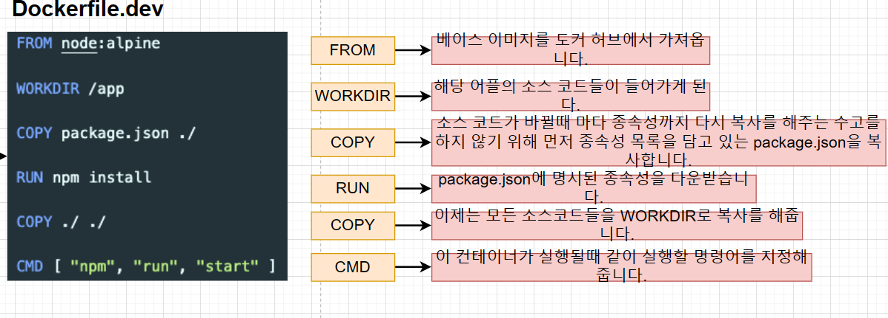
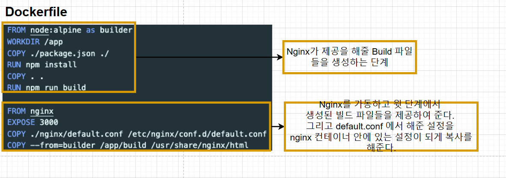
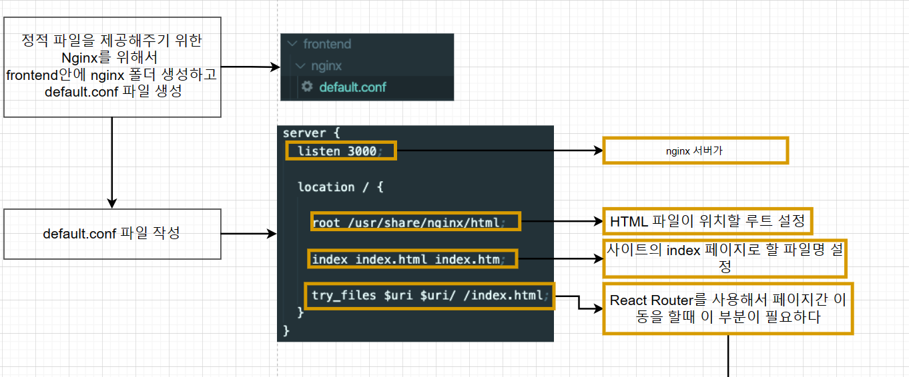
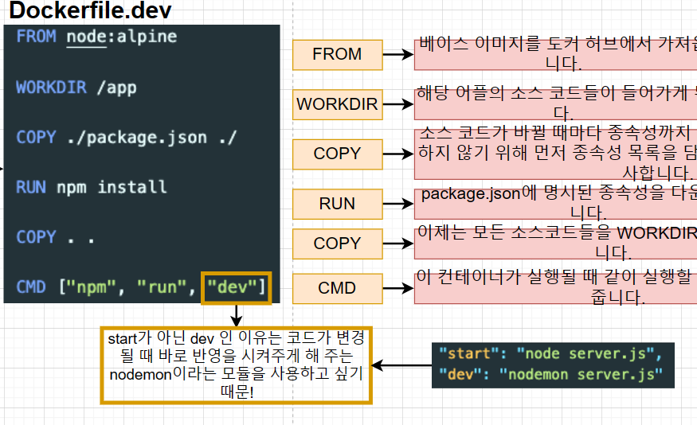
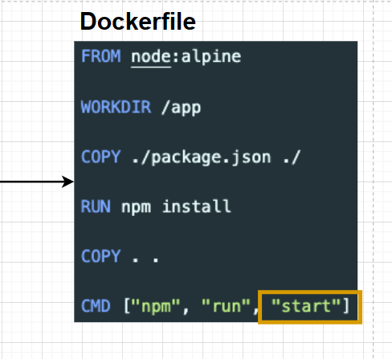
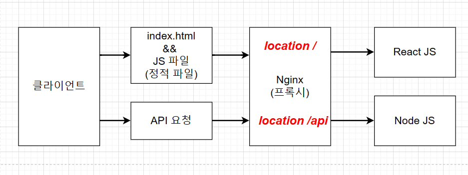
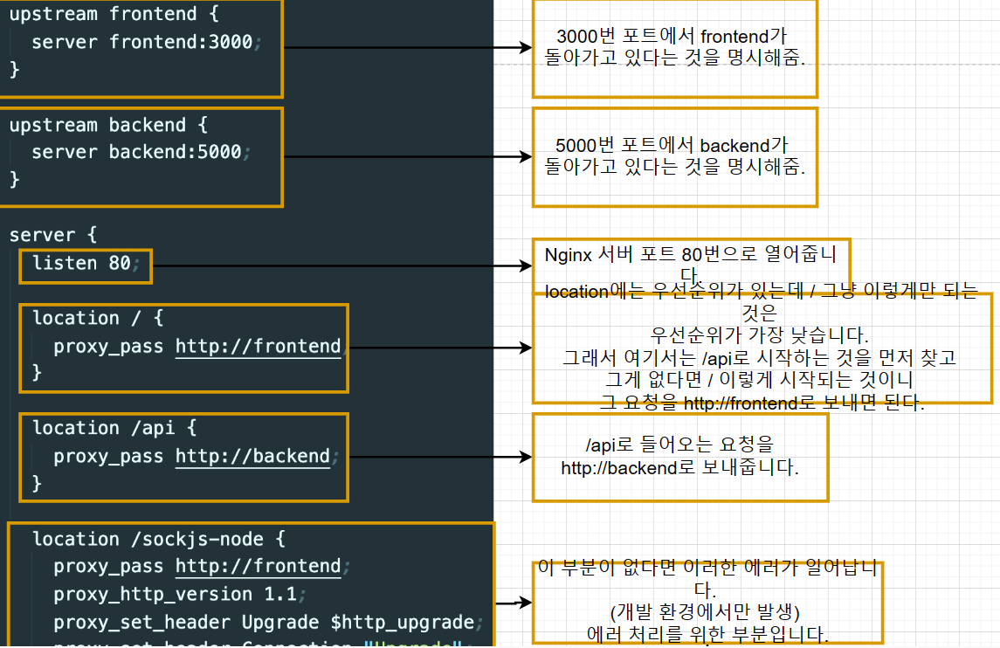
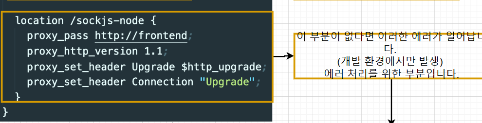
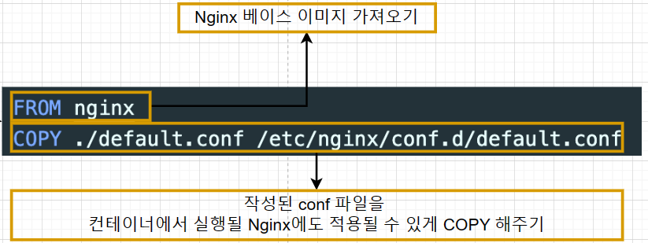

## .travis.ci 파일
- 깃허브에서 travis.ci로 소스를 어떻게 전달시키며, 전달받은 것을 어떻게 테스트하며, 그 테스트가 성공했을 때 어떻게
aws에 전달해서 배포를 할 것인지를 적어 놓은 명령어 파일.
- 
- sudo : 관리자 권한 갖기
- language : 언어, 플랫폼 선택
- services : 도커 환경 구성
- before_install : 스크립트를 실행할 수 있는 환경 구성.
- script : 실행할 스크립트
- after_success : 테스트 성공 후 할 일

## 소스코드 깃헙에 다시 배포.
- 소스 코드 변환 -> git add . -> git commit -m "내용" -> git push origin master

## Elastic Beanstalk
- apache, nginx 같은 친숙한 서버에서 java,net,php 등 및 docker와 함께 개발된 웹 응용 프로그램 및 서비스를
배포하고 확장하기 쉬운 서비스이다.
- ec2 인스턴스나 데이터베이스와 같이 많은 것을 포함한 환경을 구성하며 만들고 있는 소프트웨어를 업데이트할 때마다 
자동으로 이 환경을 관리해 준다.

## .travis.ci 파일 작성
- 
- 새롭게 추가된 부분 설정
- provider: 외부 서비스 표시
- region: 현재 사용하고 있는 aws의 물리적 장소
- app: 생성된 애플리케이션의 이름
- env: Elastic Beanstalk의 이름
- bucket_name: elastic beanstalk을 위한 s3 버킷 이름
- bucket_path: 애플리케이션의 이름과 동일
- on: branch: 어떤 브랜치에 푸시할 때 aws에 배포할 것인지 설정.

## travis ci의 aws접근을 위한 api 생성
1. iam user 생성
2. api키를 travis.yml 파일에 적어주기 => 직접 api 키를 travis.yml 파일에 적어주면 노출이 되기 때문에,
travis ci 홈페이지- 대시보드 - settings에서 환경 변수를 등록한다.
3. dockerfile에 expose 80을 넣어 줘서 포트 매핑.

## travis ci 대신 github action에 배포
- github.yaml 파일을 이용해서 코드를 github에 커밋 -> github action을 통한 테스트 -> 성공하면 elastic beanstalk에 자동으로 파일 올리기
의 과정을 거쳐서 배포할 수 있다.

## 복잡한 환경 배포 - 섹션 설명
- 
- 풀스택 애플리케이션 개발 예정.
- 
- 클라이언트에서 아무 글이나 입력을 하면 리액트를 통해서 노드로 전달된 다음에 mysql 데이터베이스로 저장한다.
- 그리고 그 저장된 것을 화면에 보여주는 앱을 구성한다. 컨테이너를 재시작해도 db에 저장된 내용은 남아 있다.
- 
- nginx의 프록시를 이용한 설계: request를 보낼 때 url 부분을 호스트 이름이 바뀌어도 변경시켜 주지 않아도 되고, 포트가 바뀌어도 변경을 안해도 되는 장점이
있다. 하지만 nginx 설정, 전체 설계가 복잡하다는 단점이 있다.

## Node.js 구성하기
- backend라는 폴더 만들기 -> package.json 파일 만들기 -> package.json 파일 안에 스크립트와 사용할 모듈들 명시해 주기
-> 시작점이 되는 server.js 만들기 -> server.js의 기본 구조 작성 -> mysql을 연결하기 위한 db.js 파일 생성 -> Host, 유저
이름, 비밀번호, 데이터베이스 이름을 명시해서 pool을 생성해줌. 그리고 생성한 pool을 다른 부분에서 쓸 수 있게 export해줌.
-> export된 pool을 시작점인 server.js에서 불러오기 -> 어플에서 필요한 두 가지 api 생성하기

## React 구성하기
- Create-React-app으로 리액트 앱 생성하기 -> ui를 위한 코드 작성 -> ui를 위한 css 작성 -> 데이터의 흐름을 위한 state 작성
-> 데이터베이스에서 필요한 데이터를 가져오기 위해 필요한 useEffect 넣어주기

## 리액트 앱을 위한 도커파일 만들기
1. frontend 파일 안에 dockerfile 생성
2. 개발 환경을 위한 dockerfile 작성
3. 운영 환경을 위한 dockerfile 작성
4. 정적 파일을 제공해주기 위한 nginx를 위해서 frontend 안에 nginx 파일 생성하고 default.conf 파일 생성
5. default.conf 파일 작성

## 개발 환경을 위한 Dockerfile.dev 작성
- 
- 1. FROM: 베이스 이미지를 도커 허브에서 가져온다.
- 2. WORKDIR: 해당 어플의 소스 코드들이 들어가게 된다.
- 3. COPY : 소스 코드가 바뀔 때마다 종속성까지 다시 복사하지 않기 위해 먼저 종속성 목록을 담고 있는 
package.json을 복사한다.
- 4. RUN: package.json에 명시된 종속성을 다운받는다.
- 5. COPY: 모든 소스들을 workdir에 복사한다.

## Dockerfile 작성
- 
- 
- nginx에 대한 공부 필요.

## 노드 앱 도커파일 작성
- 
- 
- 개발, 운영 환경을 위한 dockerfile을 따로 작성한다.

## DB에 관해서
- 개발 환경과 운영 환경에서 다룰 데이터베이스를 따로 사용하기로 했다.
- 개발 환경은 도커 환경을 이용하고, 운영 환경은 AWS RDS를 이용한다.
- 실제 중요한 데이터를 다루는 운영 환경에서는 더욱 안정적인 AWS RDS를 이용하여 DB를 구성한다.

## nginx
- nginx가 쓰이는 곳 2군데 : 하나는 proxy를 이유로, 하나는 static 파일을 제공해 주는 역할을 하고 있다.
- 
- nginx의 프록시 기능
- 클라이언트에 요청을 보낼 때 정적 파일을 원할 때는 nginx의 설정에 따라 자동적으로 react js로 보내주며, api 요청일
경우에는 node js로 보내준다.
- nginx가 요청을 나눠서 보내주는 기준은 location이 /로 시작하는지, /api로 시작하는지에 따라서 나눠준다.
- /로 시작하면 react js로 보내주고, /api로 시작하면 node js로 보내준다.

## 프록시 기능을 위한 nginx 설정
1. nginx 폴더와 default.conf 파일, dockerfile 생성
2. default.conf 파일에 위에 프록시 기능 작성
- 
- 
- 위는 default.conf 파일입니다.
3. nginx를 위한 dockerfile 작성
- 
- nginx 베이스 이미지를 가져오고, 작성된 default.conf 파일을 컨테이너에서 실행될 nginx에 적용할 수 있게 copy 해준다.