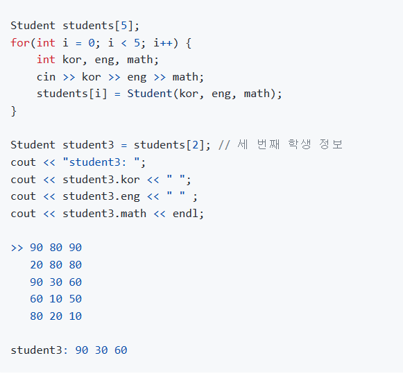
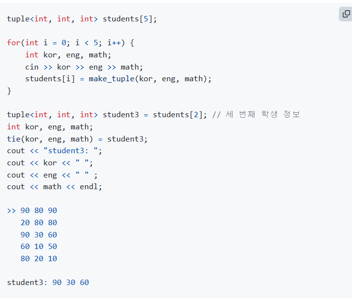
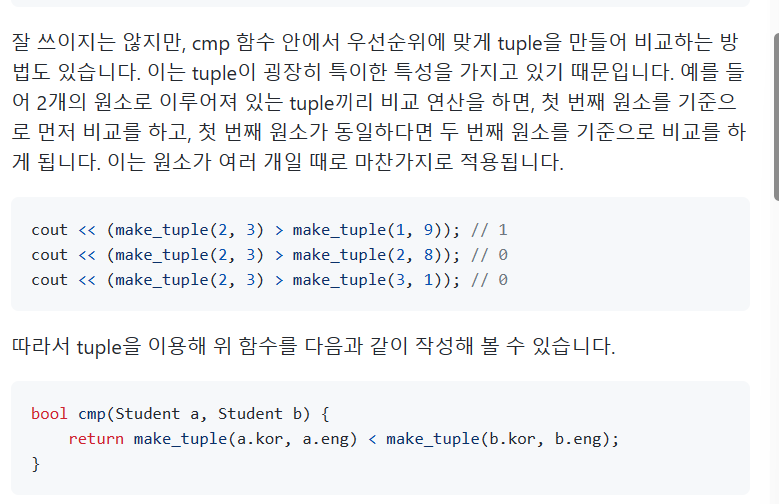

## 형변환
- string to int : stoi() 함수 사용
- int to string : to_string() 함수 사용, 인수로는 int뿐만 아니라 모든 인수 사용 가능.
- stoi의 경우 문자열의 숫자와 문자가 섞여 있다면, 앞에서부터 문자가 나올 때까지의 숫자만을 
변환해 준다. ex) 2s3

## deque
- vector의 단점을 보완하기 위해 만들어진 컨테이너이다. 배열 기반의 구조
- vector는 새로운 원소가 추가될 때 메모리 재할당 후 이런 원소를 복사하는 방식으로 동작한다 : 삽입 시에 성능 안좋음.
- deque는 vector의 단점을 보완하기 위해서 여러 개의 메모리 블록을 할당하고 하나의 블록처럼 여긴다. => 메모리가
부족할 때마다 일정한 크기의 새로운 메모리 블록을 할당한다.
- deque 중간에 원소를 삽입하거나 삭제할 수 있다.

## tuple
- #include <tuple> 추가 필요.
- tuple<int, int, int> t = make_tuple(30,15,40);
- int v1 = get<0>(t); //30
- int v2 = get<1>(t); //15
- tie를 선언할 수도 있다.
- tie(v1, v2, v3) = t; // v1, v2, v3에 각 값 대입.
- tie(v1, ignore, ignore) = t; //v1에만 값 넣어주기.

## pair
- 사용할 숫자가 정확히 2개인 경우에는 pair을 이용하기도 한다.
- pair 사용을 위해서는 #include <utility> 헤더가 필요하다.
- pair<int, int> p = make_pair(1, 5);
- cout << p.first << endl; // 1 출력

## class를 이용한 객체 리스트
- class를 이용한 객체 선언과 동시에, 이 각각의 객체를 원소로 갖는 리스트를 이용한다.
Student students[5] = { Student(90, 80, 90), Student(20, 80, 80), ... };
Student students3 = students[2]; 이런 식으로 세 번째 학생 정보를 가져올 수 있다.
- 

## tuple을 이용한 객체 리스트
- 

## class를 이용한 객체 정렬
- 국어, 영어, 수학 점수를 포함한 학생 5명의 정보가 주어졌을 때, 국어 점수를 기준으로 오름차순 정렬.
- `bool cmp(Student a, Student b) { return a.kor < b.kor; }`
- 이후 sort(students, students+5, cmp) 이런 식으로 정렬.
- 국어 점수를 기준으로 오름차순 정렬하되, 국어 점수가 같다면 영어 점수를 기준으로 오름차순 정렬도 선언 가능.
- 
- 잘 쓰이지는 않지만 위처럼 선언도 가능.

## tuple을 이용한 객체 정렬
- tuple의 경우 따로 custom comparator가 필요하지 않다. 기본적으로 첫 번째 값을 기준으로 오름차순
정렬해주고, 첫 번째 값이 같다면 두 번째를 기준으로 오름차순 정렬을 반복한다.
- tuple에서 국어 점수를 기준으로 내림차순 정렬을 위해서는 처음 tuple을 만들 때 -를 붙여서 넣어 준다.

## 소수점 맞춰서 출력하기
- cout << fixed 를 이용해서 소수점 자리 표현을 고정하겠다는 뜻을 선언하고, 
cout.precision(n)을 선언해서 소수 n자리까지 반올림한 값을 출력하면 된다.

## reverse 함수
- algorithm 헤더에 정의되어 있다.
- reverse(s.begin(), s.end()) 로 정의할 수 있다.