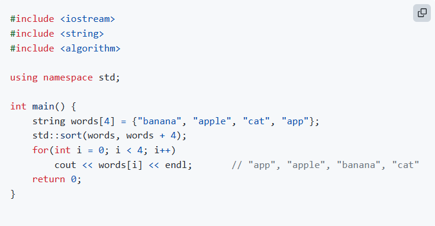
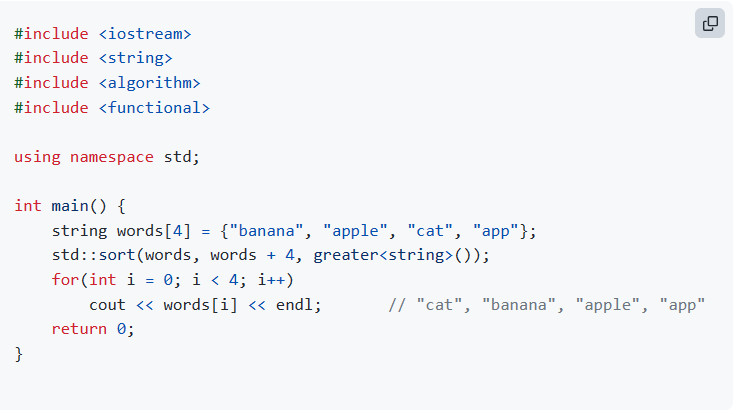

## 문자열 리스트 정렬
- n개의 단어가 주어졌을 때, 그 단어들을 사전순으로 정렬하여 출력
- 문자열 목록을 정렬할 때 sort() 함수를 그대로 쓰면 된다.
- 
- 내림차순 정렬의 경우 fucntional 헤더와 greater<string>()을 쓰면 된다.
- 

## 버블 정렬
- 가장 단순한 정렬 알고리즘으로, 1번째와 2번째, 2번째와 3번째, ... n-1번째와 n번째 값을 비교한다.
- O(n^2)의 시간 복잡도를 보여 준다.

## 선택 정렬
1. 전체 값 중 가장 작은 값을 찾음
2. 해당 값을 맨 첫번째에 배치함
3. 첫 번째 값을 제외하고 가장 작은 값을 찾아 두번째에 배치함
4. 두번째, 세번째, ..., n-1번째 값을 제외하고 가장 작은 값을 찾아 정해진 위치에 배치한다.

## 삽입 정렬
- 앞에서부터 순서대로 보면서, 앞에 있는 모든 원소가 정렬이 되어 있다는 가정 하에서 현재 원소의
위치를 적절하게 집어넣는 행렬이다.
- 현재 위치에 있던 7을 앞의 원소와 비교하여, 앞에 있는 원소의 크기가 더 크다면, 두 원소의 위치를 바꾼다.
- 앞에 있는 원소가 더 크지 않으면, 움직이는 것을 멈춘다.
- 시간 복잡도는 O(N^2)이다.
- 원소가 1개인 경우부터 시작해 2번째 원소, 3번째 원소,...n번째 원소까지 진행하며 더 작은 원소가 있다면 그것을 
앞으로 땡기고, 그 뒤에 있는 원소는 다 뒤로 한칸씩 땡겨준다.(코드 참고)

## 기수 정렬
- 맨 뒤에 있는 자릿수부터 해당 자리수를 기준으로 정렬한 뒤, 점점 앞으로 이동하며 각 자리수를 기준으로
정렬하다가 최종적으로 가장 높은 자리수를 기준으로 정렬하는 방법이다.
- 시간 복잡도는 O(K^N)이다. (K는 자릿수)

## 정렬간 속도 비교
- 버블 정렬의 경우, 일반적으로 셋 중 가장 느리지만 정렬된 배열의 경우 시간이 빨라진다.
- 선택 정렬의 경우, 배열의 상태와 상관없이 어떠한 상황이던 동일한 시간을 보여준다.
- 삽입 정렬의 경우, 일반적으로는 가장 빠르지만 값이 반대로 정렬되어 있는 경우 성능이 떨어진다.

## 병합 정렬
- 배열의 길이가 1개가 될 때까지 재귀적으로 쪼개기 -> 쪼갠 배열을 합쳐가며 정렬된 배열로 만들기 라는
과정을 거치게 된다.
- 배열을 쪼개는 과정 O(logn), 배열을 합치는 과정 O(N), 즉 o(nlogn)이라는 시간복잡도이다.
