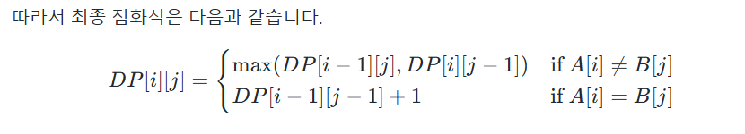

## LCS
- 최장 공통 부분 수열, 부분 수열은 순서대로 뽑아서 나올 수 있는 수열.
- 예를 들어, ABABA와 BAAB의 LCS는 BAB이므로, LCS의 길이는 3이 된다.
- 점화식을 다음과 같이 세울 수 있고, 이를 이용하여 dp 테이블을 만들 수 있다.
- 

## 편집 거리
- 문자열 A를 문자열 B로 바꾸기 위해 필요한 최소 연산 횟수
- 사용 가능한 연산은 하나의 문자를 원하는 위치에 삽입하거나, 특정 문자를 삭제하거나, 특정 문자를
다른 문자로 바꾸는 세 가지 연산이 있다.

## 그리디 알고리즘
- 그리디 알고리즘을 통해 Knapsack 문제를 해결할 수도 있다.
- 가격/무게 값이 큰 보석부터 담으면 된다.
- 이처럼 현재 상황에서 최선이다 싶은 것을 계속 반복하는 알고리즘을 그리디 알고리즘이라고 한다.
- 회의실 준비 문제 : 적절하게 회의 요청을 수락하여 최대로 많은 회의가 진행되도록 만들기
- 회의 끝시간을 기준으로 오름차순 정렬한 뒤, 순서대로 보며 겹치지 않는 회의를 순차적으로 골라주면
최적의 답을 구할 수 있다.