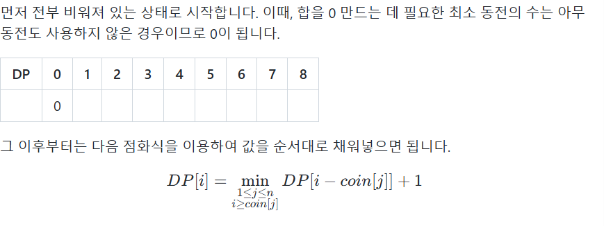
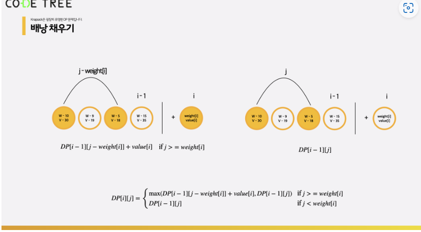

## 숫자 n의 각 자리 숫자의 합을 반환하는 함수
- F(n) = F(n을 10으로 나눈 몫) + (n을 10으로 나눈 나머지)

## 각 자리 숫자들 중 짝수를 제외한 합
1. n을 10으로 나눈 나머지가 짝수인 경우
-> F(n) = F(n을 10으로 나눈 몫)
2. n을 10으로 나눈 나머지가 홀수인 경우
-> F(n) = F(n을 10으로 나눈 몫) + (n을 10으로 나눈 나머지)

## Tabulation
- 재귀함수 이외에도, 동적 계획법 문제를 해결할 수 있는 방법
- for문을 이용하는 방법으로, 순서대로 배열에 값을 채워 나가는 방식 : Tabulation
- Memoization의 경우에는 높은 수에서 낮은 수로 내려가기 때문에 탑다운 방식이라고 부르며, 
Tabulation의 경우에는 아래에서 값을 채워 나가기 때문에 바텀업 방식이라고 부른다.

## dp 문제 예시
1. 타일 채우기 : 2 * n 크기의 벽을 2*1, 1*2 크기의 타일로 채우기
- dp[i] = dp[i-1] + dp[i-2]

2. BST 개수
- BST : 자식을 2개 이하로 갖는 이진 탐색 트리
- 각 노드마다 왼쪽에 있는 모든 노드들의 값이 해당 노드의 값보다 작아야 하고, 오른쪽에 있는 
모든 노드들의 값이 해당 노드의 값보다 커야 한다.
- root가 정해졌을 때 만들 수 있는 서로 다른 BST의 개수는
  (왼쪽에 들어갈 수로 만들수 있는 서로 다른 bst의 개수) * (오른쪽에 들어갈 수로 만들 수 있는 서로 다른 BST)
- (0, n-1), (1, n-2), (2, n-3)....
- 

## 조건에 맞게 선택적으로 전진
- 6개의 숫자가 주어졌을 때, 가장 긴 증가 부분 수열의 길이(LIS)를 구할 수 있다.
- dp[i]를 마지막으로 고른 원소의 위치가 i인 부분 수열 중 최장 증가 부분 수열의 길이라 정의한다.

## 아이템을 적절히 골라야 하는 경우
- 가치가 1,4,5인 3개의 동전이 주어졌을 때, 금액 8을 거슬러 주기 위해 필요한 최소 동전의 수
- 다음과 같이 DP Table을 만든다.
- 
- dp[i]는 지금까지 선택한 동전의 합이 i라 했을 때, 필요한 최소 동전 횟수
- 

## knapsack 문제
- 도둑이 보석방을 털러 갔는데, 도둑 가방의 크기는 8이고, 보석은 종류별로 단 하나씩만 있다.
보석의 무게와 가격은 정해져 있다. => 동적 계획법 사용해야 함.
- 다음 공식을 사용하여 DP 테이블을 만든다.
- 
- 
